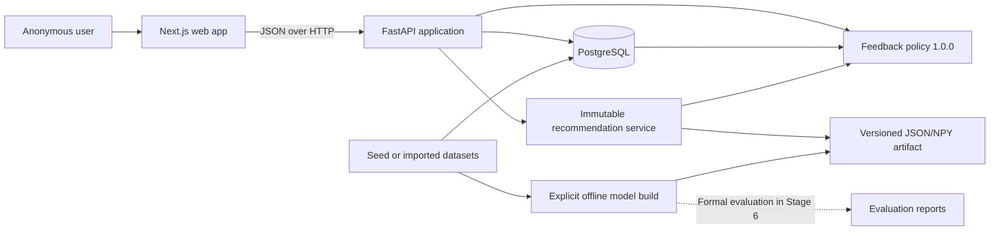

# GameLens AI

GameLens AI is a production-style, full-stack game recommendation portfolio
project. It demonstrates recommendation-system fundamentals, data and ML
engineering, API and database design, frontend development, testing,
containerization, and reproducible evaluation.

The project owns its future ranking logic. External services may later enrich
game metadata, but they will not replace the recommendation engine.

## Current status

**Stage 4 complete and verified 2026-08-13; Stage 5 Phase 0–4 audit,
ingestion-preparation, collaborative-artifact, pure-scoring, and ML-only hybrid
policy foundations verified through 2026-08-29; Phase 5 lifecycle/readiness and
API orchestration not started**

The detailed
[Stage 5 collaborative-and-hybrid engineering plan](docs/stage-5-collaborative-hybrid-ranking-plan.md)
now has two deliberately separate Phase 0–1 paths. The UCSD Steam verifier,
ingestion-preparation profiler, and aggregate suitability audit inspect only
ignored local bytes and keep the source explicitly not integrated. The
first-party path adds separate contribution-consent storage, monotonic source
revision, a default-off repeatable-read/read-only extractor, canonical
aggregate audit, and a strictly test-only project-authored fixture. Phase 2
adds the bounded sparse item-item cosine trainer, transparent identity-free
artifact, hardened validator/immutable loader, aggregate inspector, and a
guarded fixture build command. Phase 3 adds canonical query-source selection,
bounded CSR lookup, a pure collaborative scorer, exact-row base and affinity
materializers, and an ML-only Phase 4 handoff. Phase 4 adds the versioned hybrid
candidate union, fixed-point policy, structured evidence, cautious prose, and
public exact-Stage-4 fallback boundary. No product contribution-consent flow,
approved live build, collaborative readiness orchestration, or serving path
exists.

The repository now provides:

- A Python 3.12 FastAPI catalog API and PostgreSQL 16 persistence.
- A reviewed Alembic migration chain and deterministic 30-game synthetic seed.
- A responsive Next.js 16.2, React 19.2, and strict TypeScript 5.9 web
  application.
- A generated OpenAPI TypeScript contract and one project-owned browser API
  client.
- URL-backed catalog title search, single-value taxonomy filters, sorting, and
  pagination.
- Numeric game details with deliberate loading, empty, validation, not-found,
  unavailable, and nullable-field states.
- A deterministic popularity baseline and sparse TF-IDF content recommender
  built from an explicit, fingerprinted PostgreSQL snapshot.
- A checksum-validated, non-executable JSON/NPY artifact loaded once by the API.
- A bounded, read-only UCSD Steam source preflight that verifies exact local
  archives, profiles only aggregate source facts, and leaves license,
  provenance approval, GameLens catalog mapping, and activation gates closed.
- A separate optional contribution-consent and monotonic-revision contract that
  grants no authority to existing users and excludes recommendation events
  from labels and revision changes.
- A default-off, identity-free live interaction audit plus a deterministic
  project-authored fixture gated to `ENVIRONMENT=test`; neither path writes a
  row-level snapshot, and only the guarded fixture path may build the separate
  aggregate collaborative artifact.
- A canonical binary CSR and bounded sparse item-item cosine pipeline with
  support pruning, round-half-up similarity units, deterministic top-neighbor
  selection, and stable-slug tie-breaking.
- A checksum-complete JSON/NPY collaborative bundle, strict non-pickle loader,
  immutable arrays, lifecycle checks, atomic unused-path promotion, and
  privacy-safe aggregate inspection.
- A deterministic, identity-free collaborative candidate scorer with bounded
  query sources/edges, reconstructible source evidence, typed no-support
  outcomes, and exact-row content/affinity materialization.
- A public ML-only `gamelens-hybrid-ranking/1.0.0` policy with pre-top-K
  candidate union, fixed-point base/affinity/collaborative contributions,
  played adjustment, reconstructible evidence, deterministic ordering, and an
  exact Stage 4 fallback result for every typed unavailable/no-support reason.
- A bounded, typed `POST /api/v1/recommendations` contract with observable
  content, platform, and popularity components plus structured evidence.
- Accessible anonymous onboarding and explained results at `/recommendations`;
  selections remain request-scoped and are not persisted.
- An opt-in anonymous-session path with a host-only `HttpOnly` cookie,
  explicit versioned consent, HMAC-digested lookup, exact-origin checks, and
  CSRF protection for protected mutations.
- User-scoped replace-all preferences; temporal like/dislike, played,
  wishlist, and half-step rating state; and clear-all deletion.
- A separately versioned `gamelens-feedback-adjustment` `1.0.0` ranker plus a
  protected personalized endpoint that records one bounded model/data/policy
  event in the same committed use case.
- An accessible opt-in, rehydration, feedback, expiry/re-consent, and
  clear-data experience that leaves the Stage 3 request-only flow available.
- Preview-by-default, bounded retention and bulk-session-revocation commands;
  execution requires explicit cutoffs and the confirmation emitted by preview.
- Vitest, React Testing Library, Playwright, axe, pytest, PostgreSQL integration,
  Ruff, and Docker-first quality workflows.

The completed
[Stage 3 plan and verification record](docs/stage-3-content-recommendation-mvp-plan.md)
documents the exact ranking, artifact, quality, and security findings. Model
status is `ready` only when an operator configures a valid artifact whose data
fingerprint matches one transactionally consistent catalog snapshot. Missing,
corrupt, incompatible, or stale artifacts and invalid current catalog data fail
clearly without affecting catalog routes. Invalid catalog data is reported as
`catalog_invalid`. Scores are deterministic ranking signals, not probabilities
or claims of real-world recommendation quality.

The detailed
[Stage 4 feedback-and-persistence engineering plan](docs/stage-4-feedback-persistence-plan.md)
records the completed implementation on `feat/stage-4-feedback-persistence`.
Final evidence passes 184 fast API tests with 89%
diagnostic coverage, 52 ML tests with 83%, 76 web tests with 67.15% statement/
71.4% line coverage, and 49 disposable-PostgreSQL integration tests in 4.53
seconds. Ruff checks 112 Python files; strict TypeScript, ESLint, Prettier,
production build, generated OpenAPI drift, both npm audits, and all three
Compose definitions pass. The exact-host Docker browser gate passes 38/38 in
1.3 minutes without retry using two workers: 28 Chromium, 5 Firefox, and 5
WebKit. Its isolated containers, network, and volume were removed, and the
post-teardown Compose process list was empty.

## Implemented user experience

An anonymous development user can:

1. Understand what catalog and recommendation functionality works now.
2. Browse 30 fictional titles at `/games`.
3. Search titles and combine one genre, tag, and platform filter with
   deterministic sorting.
4. Reload, bookmark, share, and navigate browser history without losing catalog
   state.
5. Open reader-relevant game details and return to the previous catalog URL.
6. Recover from malformed links, empty results, missing games, metadata
   failures, and backend downtime.
7. Select up to five example games and bounded positive genre, tag, and platform
   preferences, review them, and request ranked recommendations.
8. Inspect component scores and evidence, adjust the request, or start over.
9. Explicitly opt in to a 180-day anonymous saved session, rehydrate it after
   reload, replace the complete saved preference set, and generate a
   feedback-aware shortlist.
10. Save or clear like/dislike, played, wishlist, and half-step rating state,
    renew outdated consent explicitly, or delete the anonymous session and all
    owned data.

The request-only Stage 3 path still omits credentials and writes no user-owned
state. Saved behavior is a separate explicit-consent path; it is not account
authentication and has no cross-device recovery.

## Architecture



The web application, backend, persistent data, and offline ML workflow
remain separate. Training never runs inside an API request. See
[Architecture](docs/architecture.md) for detailed boundaries.

Stage 5 Phase 0–4 implements a separate consent-aware interaction extractor,
aggregate audit, revision contract, test fixture, offline collaborative
artifact, pure candidate scorer/materializers, and versioned hybrid policy in
the ML package. The collaborative artifact, scorer, and hybrid ranker are not
loaded by the API ranking runtime yet; lifecycle, readiness, response/event,
and serving nodes remain inactive.

## Technology

| Area                 | Technology                                                                             |
| -------------------- | -------------------------------------------------------------------------------------- |
| API                  | Python 3.12, FastAPI, Pydantic v2, Uvicorn                                             |
| Persistence          | PostgreSQL 16, SQLAlchemy 2.x, Psycopg 3, Alembic                                      |
| Web                  | Node.js 24.18 LTS, Next.js 16.2.12, React 19.2.8, TypeScript 5.9.3, Tailwind CSS 4.3.3 |
| Web quality          | ESLint 9.39, Prettier 3.9, Vitest 4.1, Testing Library, Playwright 1.62, axe-core      |
| ML                   | NumPy 2.5, SciPy 1.18, scikit-learn 1.9, transparent JSON/NPY sparse artifacts         |
| Local infrastructure | Docker Compose                                                                         |
| API quality          | pytest, disposable PostgreSQL integration tests, Ruff                                  |

Direct web and API dependencies are exactly pinned. npm commits
`apps/web/package-lock.json`; the API container installs its Linux/Python graph
from `apps/api/requirements.lock`.

## Repository layout

```text
.
|-- apps/
|   |-- api/                 # FastAPI app, Alembic, tests, development image
|   `-- web/                 # Next.js app, generated contracts, tests, images
|-- data/
|   |-- catalog/             # Project-authored development catalog
|   |-- external/            # Source metadata/audits; payloads stay ignored
|   `-- fixtures/            # Reviewed project-authored test inputs
|-- docs/                    # Architecture, data, plans, roadmap, handoffs
|-- infra/
|   |-- docker-compose.test.yml
|   `-- docker-compose.e2e.yml
|-- ml/                      # Offline recommender package, tests, and ignored artifacts
|-- scripts/                 # Reserved cross-project scripts
|-- .env.example
|-- docker-compose.yml       # App, model, quality, and isolated source-audit services
|-- Makefile                 # Optional command shortcuts
`-- README.md
```

## Prerequisites

- Git
- Docker Desktop with Docker Compose
- Node.js 24 LTS and npm 11 for direct frontend work
- Python 3.12 for the optional host API workflow
- GNU Make is optional; direct PowerShell, npm, and Docker commands are
  documented

A host PostgreSQL installation is not required. The Docker-first browser suite
also does not require host Playwright browser binaries.

## Docker-first local setup

Create the ignored root environment file:

```powershell
Copy-Item .env.example .env
```

Validate configuration, build images, migrate and seed explicitly, then start
the full stack:

```powershell
docker compose --profile quality config --quiet
docker compose -f infra/docker-compose.test.yml config --quiet
docker compose -f infra/docker-compose.e2e.yml config --quiet
docker compose build api web
docker compose up -d db
docker compose run --build --rm api python -m alembic upgrade head
docker compose run --build --rm api python -m app.db.seed
docker compose --profile model run --build --rm model-builder `
    python -m app.commands.recommendation_artifact build
docker compose --profile model run --rm --no-deps model-builder `
    python -m app.commands.recommendation_artifact validate
docker compose up -d api web
docker compose ps
```

Open:

```text
http://localhost:3000/
http://localhost:3000/games
http://localhost:3000/recommendations
http://localhost:8000/docs
http://localhost:8000/openapi.json
```

PostgreSQL, API, and web ports bind only to `127.0.0.1`. Migrations and seed
operations remain explicit; ordinary API or web startup does not mutate the
database.

Artifact directories are immutable. After a catalog or model change, set
`MODEL_ARTIFACT_PATH` in `.env` to a new path under `/artifacts` (for example,
`/artifacts/content-v1-r2`), run the build and validation commands again, then
recreate the API. This keeps the previous bundle available for rollback and
prevents an in-place overwrite of a loaded model. The hardened loader rejects
non-canonical CSR indices; operators upgrading an existing Stage 3 artifact
must rotate the path and rebuild and validate the bundle before restarting the
API.

The Phase 2 collaborative bundle follows the same immutable-path rule but has a
separate `COLLABORATIVE_ARTIFACT_PATH` and lifecycle. `make collaborative-build`
and `make collaborative-validate` operate only on the guarded synthetic fixture;
selecting this path does not activate API scoring yet.

Stop services without deleting development data:

```powershell
docker compose down
```

`docker compose down --volumes` is intentionally not wrapped because it deletes
local development data and web dependency caches.

## Direct web workflow

With the migrated and seeded API running:

```powershell
Set-Location apps/web
Copy-Item .env.example .env.local
npm ci
npm run dev
```

The app-local `.env.local` is ignored. Next.js does not automatically load the
repository-root `.env` when commands run from `apps/web`. The OpenAPI
generation scripts do load the app-local Next.js environment, so direct npm
development and contract checks use the same API base URL.

## Root commands

| Command                               | Purpose                                                           |
| ------------------------------------- | ----------------------------------------------------------------- |
| `make config`                         | Validate development, API-test, and browser-test Compose files    |
| `make build` / `make build-web`       | Build API or web development images                               |
| `make up` / `make down`               | Start or stop containers; migration and seed remain explicit      |
| `make logs` / `make api` / `make web` | Follow logs or run API/full stack in the foreground               |
| `make migrate` / `make seed`          | Upgrade schema or idempotently load the catalog                   |
| `make model-build` / `model-validate` | Build or validate the configured recommendation artifact          |
| `make collaborative-audit` / `collaborative-fixture-audit` | Audit the blocked live source or guarded fixture |
| `make collaborative-build` / `collaborative-validate` | Build or validate the guarded fixture artifact |
| `make retention-preview`              | Preview eligible event/session retention rows without mutation    |
| `make ucsd-steam-verify` / `ucsd-steam-prepare` | Verify pinned source bytes or emit preparation aggregates |
| `make ucsd-steam-audit` / `ucsd-steam-audit-check` | Audit source support or compare it with the committed report |
| `make test-ml`                        | Run deterministic ML, artifact, and ranking tests                 |
| `make test` / `make test-integration` | Run fast API or disposable-PostgreSQL tests                       |
| `make test-web`                       | Run web type, lint, format, test, build, and contract-drift gates |
| `make test-web-e2e`                   | Run browser tests against isolated tmpfs PostgreSQL               |
| `make lint` / `make format`           | Check or apply Ruff rules                                         |
| `make lint-web` / `make format-web`   | Check or apply web lint/format rules                              |
| `make api-types`                      | Refresh web types from the running API OpenAPI document           |

Every optional Make target has a direct equivalent in the
[API README](apps/api/README.md), [ML README](ml/README.md), or
[web README](apps/web/README.md).

## Environment variables

| Variable                                              | Purpose                                                                       |
| ----------------------------------------------------- | ----------------------------------------------------------------------------- |
| `POSTGRES_DB` / `POSTGRES_USER` / `POSTGRES_PASSWORD` | Local database identity                                                       |
| `POSTGRES_PORT`                                       | Development PostgreSQL host port                                              |
| `APP_NAME`                                            | API title exposed in OpenAPI and health metadata                              |
| `ENVIRONMENT`                                         | `development`, `test`, or `production`                                        |
| `API_HOST`                                            | Host-Python bind address; Compose binds the container to `0.0.0.0` internally |
| `API_PORT`                                            | API host port; the container listens on 8000                                  |
| `DATABASE_URL`                                        | Host SQLAlchemy PostgreSQL connection URL                                     |
| `CORS_ORIGINS`                                        | Comma-separated explicit browser origins                                      |
| `LOG_LEVEL`                                           | API structured logging level                                                  |
| `MODEL_ARTIFACT_PATH`                                 | Builder/API container path to the validated recommendation artifact           |
| `COLLABORATIVE_ARTIFACT_PATH`                         | Separate immutable collaborative bundle path; blank leaves it unconfigured    |
| `COLLABORATIVE_LIVE_DATA_ENABLED`                     | Default-off live collaborative extraction gate                               |
| `COLLABORATIVE_CONTRIBUTION_CONSENT_VERSION`          | Explicit contribution-policy version required before live audit               |
| `COLLABORATIVE_ALLOW_TEST_FIXTURE`                    | Test-only fixture read/build gate; never enable for production                 |
| `ANONYMOUS_SESSION_SECRET`                            | Server-only HMAC key; replace the development default outside local use       |
| `ANONYMOUS_SESSION_COOKIE_NAME` / `_PATH`             | Host-only cookie name and API path scope                                      |
| `ANONYMOUS_SESSION_COOKIE_SECURE` / `_SAMESITE`       | Cookie transport policy; production requires `Secure=true`                    |
| `ANONYMOUS_SESSION_TTL_SECONDS`                       | Fixed anonymous-session lifetime; default 15,552,000 seconds (180 days)       |
| `CONSENT_VERSION` / `NEXT_PUBLIC_CONSENT_VERSION`     | Matching API/browser identifier for the accepted consent copy                 |
| `CSRF_HEADER_NAME`                                    | Protected-request CSRF header; default `X-CSRF-Token`                         |
| `RECOMMENDATION_EVENT_RETENTION_DAYS`                 | Default event preview cutoff; default 90 days                                 |
| `RETENTION_BATCH_SIZE`                                | Bounded retention/revocation batch size; default 500                          |
| `APP_UID` / `APP_GID`                                 | Linux numeric owner used by the non-root API/model-builder image              |
| `NEXT_PUBLIC_API_URL`                                 | Browser-visible absolute FastAPI base URL                                     |
| `WEB_PORT`                                            | Loopback web host port, default 3000                                          |
| `OPENAPI_URL`                                         | Optional trusted OpenAPI document URL for type tooling                        |
| `OPENAPI_TIMEOUT_MS`                                  | OpenAPI tooling timeout, default 15000; allowed 1000–120000                   |

Only `NEXT_PUBLIC_API_URL` and `NEXT_PUBLIC_CONSENT_VERSION` enter the browser
bundle. Never commit `.env`, `.env.local`, production credentials, session
secrets, or database URLs.

When changing published ports, keep the associated browser origin aligned:
`WEB_PORT` must match the port in `CORS_ORIGINS`, and `API_PORT` must match the
port in `NEXT_PUBLIC_API_URL`. For example, web port `3100` requires
`CORS_ORIGINS=http://localhost:3100`; API port `8100` requires
`NEXT_PUBLIC_API_URL=http://localhost:8100`.

## Stage 2 verification

The Stage 2 acceptance gate was executed on Windows, Node.js 24.18.0, npm
11.16.0, Docker Desktop 29.6.2, and Docker Compose 5.3.1 on 2026-07-30:

| Check                       | Verified result                                                                      |
| --------------------------- | ------------------------------------------------------------------------------------ |
| Clean frontend install      | `npm ci` completed from the committed lock                                           |
| Fast frontend suite         | 40 passed across 7 files                                                             |
| Frontend static quality     | strict TypeScript, ESLint, and Prettier passed                                       |
| Frontend production build   | `/`, `/games`, and `/games/[gameId]` compiled                                        |
| OpenAPI contract            | generated output matched the live Stage 1 document                                   |
| Production dependency audit | zero vulnerabilities after PostCSS 8.5.25 and Sharp 0.35.3 overrides                 |
| Browser and accessibility   | 21 passed; 13 Chromium plus 4 Firefox and 4 WebKit; no serious/critical axe findings |
| Responsive smoke            | mobile navigation and catalog/detail layouts passed at 320, 768, and 1440 CSS pixels |
| Full-stack development      | healthy stack; dependency volume repaired in place; landing/catalog returned 200     |
| Stage 1 regression          | 84 fast tests, 28 PostgreSQL integration tests, Ruff lint and format passed          |

Diagnostic frontend coverage was 41.48% statements overall. Pure configuration,
formatting, route, and API modules ranged from 82.35% to 100%; real-browser tests
own the primary catalog/detail feature coverage.

## Stage 3 verification

The Stage 3 acceptance gate was executed on Windows with Python 3.12.13,
Node.js 24.18.0, npm 11.16.0, Docker Engine 29.6.2, Docker Desktop 4.83, and
Docker Compose 5.3.1 on 2026-08-07:

| Check                          | Verified result                                                                                 |
| ------------------------------ | ----------------------------------------------------------------------------------------------- |
| Deterministic ML suite         | 25 passed; 81% diagnostic branch-aware package coverage                                         |
| Fast API suite                 | 104 passed; 92% diagnostic branch-aware application coverage                                    |
| PostgreSQL integration         | 29 passed, including read-only recommendation proof                                             |
| Frontend quality               | 45 passed; TypeScript, ESLint, Prettier, and production build passed                            |
| Browser/accessibility          | 25 passed: 15 Chromium, 5 Firefox, and 5 WebKit; no serious/critical axe findings               |
| Responsive recommendation flow | No page overflow at 320, 768, or 1440 CSS pixels                                                |
| Docker artifact flow           | Fresh tmpfs DB migrated/seeded, named artifact built, API became ready, web and E2E passed      |
| Seed artifact diagnostics      | 30 items, 1,037 terms, 1,399 nonzeros, 69,743 bytes, build 0.43 s                               |
| Online diagnostics             | Artifact load median 95.54 ms; 20 local requests median 12.37 ms and p95 13.19 ms               |
| Dependency integrity           | `pip check` passed; clean `npm ci` and full/production npm audits reported zero vulnerabilities |

Diagnostic V8 coverage was 53.25% statements overall and 77.51% for the
recommendation flow. Artifact-load timings used the Docker Desktop bind mount;
the POST sample ran inside the local container stack.

Coverage and latency are diagnostics on the synthetic local fixture, not
service-level objectives. At Stage 3 verification, Docker Scout found two
critical and two high Debian Perl advisories in the pinned development base.
The Stage 4 Dockerfile now removes unused `perl-base` after all install steps,
resolving those critical/high findings. A comprehensive scan of the rebuilt
no-cache `gamelens-ai-api:stage4-test` image with digest prefix `11b2f940731e`
reports 0 critical, 0 high, 3 medium, 27 low, and 2 unspecified findings across
193 packages. Its only-fixed scan reports no actionable fixed advisory;
runtime imports, `pip check`, and all 49 PostgreSQL integration tests remain
green. The remaining findings stay documented. The API runs non-root and
publishes to loopback locally; choosing and rescanning a production-minimal
image remains Stage 7 work.

## Stage 4 verification

The Stage 4 acceptance gate completed on 2026-08-13 on branch
`feat/stage-4-feedback-persistence`:

| Check | Verified result |
| --- | --- |
| ML | 52 passed; 83% diagnostic coverage |
| API | 184 passed; 89% diagnostic coverage; Ruff clean across 112 files |
| PostgreSQL | 49 passed in 4.53 s, including populated downgrade/re-upgrade, concurrency, cascades, retention, and revocation |
| Web | 76 passed; 67.15% statements and 71.4% lines; type, lint, format, build, and OpenAPI drift passed |
| Browser/accessibility | 38/38 in 1.3 min without retry: 28 Chromium, 5 Firefox, 5 WebKit; stateless and active axe paths passed |
| Security/dependencies | `pip check` passed; full and production npm audits reported zero vulnerabilities |
| Compose/privacy | All three Compose definitions passed; final review found no retained credential, trace, coverage, or browser artifact |
| Teardown | E2E containers, network, and volume removed; `compose ps` empty |

The browser suite uses `gamelens.test` on ports 3000/8000. WebKit active-state
accessibility includes a real consent `201`; real Origin and CSRF rejection
paths return `403`. The browser re-consent scenario intentionally injects an
outdated profile read before a real CSRF-protected post; actual expiry and
re-consent mutation are verified in the API/PostgreSQL suites. These are
functional and safety results on synthetic fixtures, not quality or
service-level claims.

## Project documentation

- [Architecture](docs/architecture.md)
- [Data model](docs/data-model.md)
- [Recommendation design](docs/recommendation-design.md)
- [Roadmap](docs/roadmap.md)
- [Stage 1 engineering plan](docs/stage-1-backend-database-plan.md)
- [Stage 2 engineering plan and completion record](docs/stage-2-frontend-foundation-plan.md)
- [Stage 3 plan and completion record](docs/stage-3-content-recommendation-mvp-plan.md)
- [Stage 4 feedback-and-persistence engineering plan](docs/stage-4-feedback-persistence-plan.md)
- [Stage 5 collaborative-and-hybrid engineering plan](docs/stage-5-collaborative-hybrid-ranking-plan.md)
- [Web application commands and contracts](apps/web/README.md)
- [API setup and contracts](apps/api/README.md)
- [Infrastructure workflows](infra/README.md)

## Current limitations

- The possession-based anonymous session is not authentication or an account:
  there is no authorization role model, cross-device recovery, or identity
  provider.
- Retention and bulk revocation are explicit operator commands, not scheduled
  jobs. Bulk key retirement selects the immutable identity-creation cohort with
  `--created-before`: quiesce creation/re-consent and drain in-flight requests,
  capture the database-time cutover while switching issuance to the new secret,
  revoke that cohort until `remaining` is zero, then retire the old secret.
  Expiry prevents access immediately, while eligible rows are removed by a later
  confirmed cleanup run.
- The 30-game synthetic seed supports functional and reproducibility checks,
  including feedback lifecycle behavior, not recommendation-quality
  evaluation. The UCSD Steam source-preflight commands and aggregate audit do
  not integrate that external source or authorize its use. The collaborative
  trainer, hardened artifact contract, guarded fixture build, pure scorer, and
  ML-only hybrid policy are functional infrastructure only. No approved live
  cohort, product contribution-consent flow, hybrid serving path, API
  activation, or approved external interaction dataset is implemented. Formal
  comparative evaluation remains Stage 6.
- No external metadata service or approved remote cover-image source.
- Seed ratings and popularity values are synthetic development signals.
- Social metadata currently uses a localhost development base. A validated
  public site origin remains part of the Stage 7 deployment configuration.
- Game-detail routes use deliberate malformed-ID and missing-ID views, but the
  streamed dynamic route shell has HTTP 200. A missing-ID API response itself
  is 404; propagating status through the page requires the later
  internal-origin/deployment design.
- Production deployment, monitoring, CI, and hardened production images remain
  Stage 7 work.
- The Stage 4 development API image removes the unused vulnerable Debian
  `perl-base` package after its final install step; the clean no-cache candidate
  currently scans at zero critical/high, three medium, 27 low, and two
  unspecified findings; its only-fixed scan reports no actionable fixed
  advisory. Stage 7 must still select and rescan a production-minimal base
  before deployment.

## License

This repository is available under the [MIT License](LICENSE). Direct frontend
packages use MIT, Apache-2.0, or MPL-2.0 licenses. NumPy, SciPy, scikit-learn,
Joblib, and threadpoolctl use BSD-family licenses; Narwhals uses MIT. Dataset
and third-party metadata licenses must be documented separately before
ingestion.
