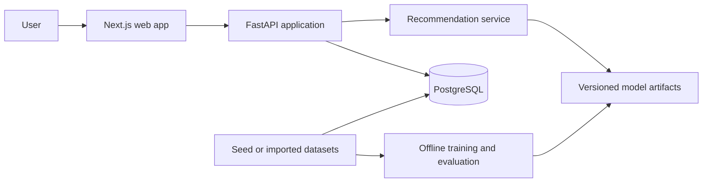

# GameLens AI

GameLens AI is a production-style, full-stack game recommendation portfolio
project. It demonstrates recommendation-system fundamentals, data and ML
engineering, API and database design, frontend development, testing,
containerization, and reproducible evaluation.

The project owns its ranking logic. External services may later enrich game
metadata, but they will not replace the recommendation engine.

## Current status

**Stage 1 complete; Stage 2 ready for implementation**

The repository now provides a runnable Python 3.12 FastAPI catalog API,
PostgreSQL 16 persistence, a reviewed Alembic migration chain, deterministic
synthetic seed data, typed API contracts, unit and PostgreSQL integration
tests, and a Docker-first development workflow.

The API supports health/readiness, paginated catalog browsing, game details,
taxonomy metadata, and an explicit `not_configured` recommendation-model
status.

The detailed
[Stage 2 frontend engineering plan](docs/stage-2-frontend-foundation-plan.md)
is ready. Frontend implementation has not started, so the current runnable
stack remains PostgreSQL and the API. A trained model remains Stage 3 work.

## Planned MVP

The complete MVP will let an anonymous development user:

1. Browse the Stage 1 game catalog.
2. Select preferred genres, tags, platforms, and example games.
3. Receive recommendations from a project-owned content model.
4. See structured reasons for each result.
5. Record feedback such as liked, disliked, played, or wishlisted.

Authentication, collaborative filtering, external metadata imports, and LLM
explanations remain later stages.

## Architecture



The web application, backend, persistent data, and offline ML workflow remain
separate. Training never runs inside an API request. See
[Architecture](docs/architecture.md) for detailed boundaries.

## Technology

| Area | Technology |
| --- | --- |
| API | Python 3.12, FastAPI, Pydantic v2, Uvicorn |
| Persistence | PostgreSQL 16, SQLAlchemy 2.x, Psycopg 3, Alembic |
| Web | Next.js, React, TypeScript, Tailwind CSS (Stage 2) |
| ML | pandas, NumPy, scikit-learn, SciPy, joblib (Stage 3+) |
| Local infrastructure | Docker Compose |
| Quality | pytest, PostgreSQL integration tests, Ruff |

Direct Stage 1 dependencies are pinned in `apps/api/pyproject.toml`. Docker
installs the complete Linux/Python 3.12 dependency graph from
`apps/api/requirements.lock`.

## Repository layout

```text
.
|-- apps/
|   |-- api/                 # FastAPI application, migration, tests, image
|   `-- web/                 # Stage 2 plan and future Next.js application
|-- data/
|   `-- seed/games.json      # 30-game deterministic synthetic catalog
|-- docs/                    # Architecture, data, recommendation, roadmap
|-- infra/
|   `-- docker-compose.test.yml
|-- ml/                      # Reserved offline ML workflow boundary
|-- scripts/                 # Future cross-project scripts
|-- .env.example
|-- docker-compose.yml       # PostgreSQL and API services
|-- Makefile                 # Optional command shortcuts
`-- README.md
```

## Prerequisites

- Git
- Docker Desktop with Docker Compose
- Python 3.12 for the optional host workflow
- GNU Make is optional; direct PowerShell/Docker commands are documented

Node.js is not required for the currently implemented Stage 1 workflow.
Stage 2 will select and pin its Node.js runtime after a compatibility smoke
test. A host PostgreSQL installation is not required.

## Local setup

Create the ignored local environment file:

```powershell
Copy-Item .env.example .env
```

Build, migrate, seed, and start the stack:

```powershell
docker compose --profile quality config --quiet
docker compose build api
docker compose up -d db
docker compose run --build --rm api python -m alembic upgrade head
docker compose run --build --rm api python -m app.db.seed
docker compose up -d api
docker compose ps
```

Migrations and seeding are explicit lifecycle operations; ordinary API startup
does not mutate the schema or catalog.
Published PostgreSQL and API ports bind only to `127.0.0.1`.

Open or request:

```text
http://localhost:8000/health
http://localhost:8000/api/v1/games?page=1&page_size=5
http://localhost:8000/docs
http://localhost:8000/openapi.json
```

Stop services without deleting the named database volume:

```powershell
docker compose down
```

`docker compose down --volumes` is intentionally not wrapped because it
deletes local development data.

## Root commands

| Command | Purpose |
| --- | --- |
| `make config` | Validate Compose |
| `make build` | Build the API development image |
| `make up` / `make down` | Start or stop db and API |
| `make logs` / `make api` | Follow logs or run API in foreground |
| `make migrate` | Upgrade the development schema |
| `make seed` | Idempotently load the deterministic catalog |
| `make test` | Run fast unit/contract tests |
| `make test-integration` | Run tests with disposable PostgreSQL |
| `make lint` / `make format` | Check or apply Ruff rules |

Every target has a direct equivalent in [the API README](apps/api/README.md).

## Environment variables

| Variable | Purpose |
| --- | --- |
| `POSTGRES_DB` / `POSTGRES_USER` / `POSTGRES_PASSWORD` | Local database identity |
| `POSTGRES_PORT` | Development PostgreSQL host port |
| `APP_NAME` | API title exposed in OpenAPI and health metadata |
| `ENVIRONMENT` | `development`, `test`, or `production` |
| `API_HOST` | Host-Python bind address; Compose overrides the container bind address |
| `API_PORT` | Host-Python port and Compose-published loopback port; the container listens on 8000 |
| `DATABASE_URL` | SQLAlchemy PostgreSQL connection URL |
| `CORS_ORIGINS` | Comma-separated explicit browser origins |
| `LOG_LEVEL` | Structured application logging level |
| `NEXT_PUBLIC_API_URL` | Stage 2 browser-visible API base URL |

Never commit `.env` or production credentials. Only `.env.example` belongs in
version control.

## Stage 1 verification

```powershell
docker compose --profile quality config --quiet
docker compose -f infra/docker-compose.test.yml config --quiet
docker compose build api
docker compose run --build --rm api python -m alembic upgrade head
docker compose run --build --rm api python -m app.db.seed
docker compose run --build --rm --no-deps quality python -m pytest tests/unit -q -p no:cacheprovider
docker compose run --build --rm --no-deps quality python -m ruff check --no-cache app tests alembic
docker compose run --build --rm --no-deps quality python -m ruff format --no-cache --check app tests alembic
docker compose -f infra/docker-compose.test.yml up -d test-db
try {
    docker compose -f infra/docker-compose.test.yml run --build --rm test-api
} finally {
    docker compose -f infra/docker-compose.test.yml down --remove-orphans
}
```

The `quality` service bind-mounts the current API source, so tests, lint, and
formatting never inspect a stale source snapshot. The integration database is
reachable only inside its isolated Compose network, uses `tmpfs`, and never
resets the persistent development volume.

The Stage 1 acceptance gate was last re-audited on 2026-07-26:

| Check | Verified result |
| --- | --- |
| Fast unit and contract suite | 84 passed |
| Disposable-PostgreSQL integration suite | 28 passed |
| Diagnostic application coverage | 92% |
| Alembic | `0001_initial_schema` upgraded to `0002_stage_1_integrity_hardening` with no schema drift |
| Deterministic seed | 30 games and 36 taxonomy records; a second run made no duplicates |
| Dependency audit | No known vulnerabilities in the locked container dependency graph |
| Runtime smoke test | Healthy non-root API and PostgreSQL containers; complete Stage 1 HTTP matrix passed |

## Project documentation

- [Architecture](docs/architecture.md)
- [Data model](docs/data-model.md)
- [Recommendation design](docs/recommendation-design.md)
- [Roadmap](docs/roadmap.md)
- [Stage 1 engineering plan](docs/stage-1-backend-database-plan.md)
- [Stage 2 frontend engineering plan](docs/stage-2-frontend-foundation-plan.md)
- [Web application status and API handoff](apps/web/README.md)
- [API setup and contracts](apps/api/README.md)

## Current limitations

- No frontend, authentication, or authorization.
- No preference or interaction write APIs.
- No active recommendation model, training, or evaluation.
- No external metadata service or cover-image ingestion.
- Seed ratings and popularity values are synthetic development signals.
- Production deployment and monitoring are deferred to Stage 7.

## License

This repository is available under the [MIT License](LICENSE). Dataset and
third-party metadata licenses must be documented separately before ingestion.
