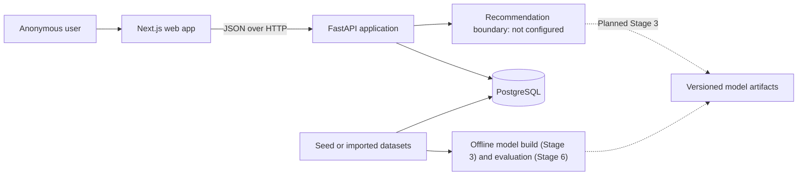

# GameLens AI

GameLens AI is a production-style, full-stack game recommendation portfolio
project. It demonstrates recommendation-system fundamentals, data and ML
engineering, API and database design, frontend development, testing,
containerization, and reproducible evaluation.

The project owns its future ranking logic. External services may later enrich
game metadata, but they will not replace the recommendation engine.

## Current status

**Stage 2 complete; Stage 3 engineering plan ready**

The repository now provides:

- A Python 3.12 FastAPI catalog API and PostgreSQL 16 persistence.
- A reviewed Alembic migration chain and deterministic 30-game synthetic seed.
- A responsive Next.js 16.2, React 19.2, and strict TypeScript 5.9 web
  application.
- A generated OpenAPI TypeScript contract and one project-owned browser API
  client.
- URL-backed catalog title search, single-value taxonomy filters, sorting, and
  pagination.
- Numeric game details with deliberate loading, empty, validation, not-found,
  unavailable, and nullable-field states.
- Vitest, React Testing Library, Playwright, axe, pytest, PostgreSQL integration,
  Ruff, and Docker-first quality workflows.

The detailed
[Stage 3 content-recommendation engineering plan](docs/stage-3-content-recommendation-mvp-plan.md)
is ready; implementation has not started. Recommendation-model status therefore
remains honestly `not_configured`, and no current screen fabricates a match,
score, or personalized result. Stage 3 will add request-scoped anonymous
onboarding and project-owned content recommendations; persisted preferences and
feedback remain Stage 4 work.

## Implemented user experience

An anonymous development user can:

1. Understand what catalog functionality works now and what is planned later.
2. Browse 30 fictional titles at `/games`.
3. Search titles and combine one genre, tag, and platform filter with
   deterministic sorting.
4. Reload, bookmark, share, and navigate browser history without losing catalog
   state.
5. Open reader-relevant game details and return to the previous catalog URL.
6. Recover from malformed links, empty results, missing games, metadata
   failures, and backend downtime.

Onboarding, recommendation results, feedback writes, and authentication remain
future capabilities because their API contracts do not exist yet.

## Architecture



The web application, backend, persistent data, and future offline ML workflow
remain separate. Training never runs inside an API request. See
[Architecture](docs/architecture.md) for detailed boundaries.

## Technology

| Area                 | Technology                                                                             |
| -------------------- | -------------------------------------------------------------------------------------- |
| API                  | Python 3.12, FastAPI, Pydantic v2, Uvicorn                                             |
| Persistence          | PostgreSQL 16, SQLAlchemy 2.x, Psycopg 3, Alembic                                      |
| Web                  | Node.js 24.18 LTS, Next.js 16.2.12, React 19.2.8, TypeScript 5.9.3, Tailwind CSS 4.3.3 |
| Web quality          | ESLint 9.39, Prettier 3.9, Vitest 4.1, Testing Library, Playwright 1.62, axe-core      |
| ML                   | NumPy, SciPy, scikit-learn, transparent JSON/NPY/NPZ artifacts (planned Stage 3)        |
| Local infrastructure | Docker Compose                                                                         |
| API quality          | pytest, disposable PostgreSQL integration tests, Ruff                                  |

Direct web and API dependencies are exactly pinned. npm commits
`apps/web/package-lock.json`; the API container installs its Linux/Python graph
from `apps/api/requirements.lock`.

## Repository layout

```text
.
|-- apps/
|   |-- api/                 # FastAPI app, Alembic, tests, development image
|   `-- web/                 # Next.js app, generated contracts, tests, images
|-- data/
|   `-- seed/games.json      # 30-game deterministic synthetic catalog
|-- docs/                    # Architecture, data, plans, roadmap, handoffs
|-- infra/
|   |-- docker-compose.test.yml
|   `-- docker-compose.e2e.yml
|-- ml/                      # Planned Stage 3 offline ML and artifact boundary
|-- scripts/                 # Reserved cross-project scripts
|-- .env.example
|-- docker-compose.yml       # PostgreSQL, API, web, and API quality service
|-- Makefile                 # Optional command shortcuts
`-- README.md
```

## Prerequisites

- Git
- Docker Desktop with Docker Compose
- Node.js 24 LTS and npm 11 for direct frontend work
- Python 3.12 for the optional host API workflow
- GNU Make is optional; direct PowerShell, npm, and Docker commands are
  documented

A host PostgreSQL installation is not required. The Docker-first browser suite
also does not require host Playwright browser binaries.

## Docker-first local setup

Create the ignored root environment file:

```powershell
Copy-Item .env.example .env
```

Validate configuration, build images, migrate and seed explicitly, then start
the full stack:

```powershell
docker compose --profile quality config --quiet
docker compose -f infra/docker-compose.test.yml config --quiet
docker compose -f infra/docker-compose.e2e.yml config --quiet
docker compose build api web
docker compose up -d db
docker compose run --build --rm api python -m alembic upgrade head
docker compose run --build --rm api python -m app.db.seed
docker compose up -d api web
docker compose ps
```

Open:

```text
http://localhost:3000/
http://localhost:3000/games
http://localhost:8000/docs
http://localhost:8000/openapi.json
```

PostgreSQL, API, and web ports bind only to `127.0.0.1`. Migrations and seed
operations remain explicit; ordinary API or web startup does not mutate the
database.

Stop services without deleting development data:

```powershell
docker compose down
```

`docker compose down --volumes` is intentionally not wrapped because it deletes
local development data and web dependency caches.

## Direct web workflow

With the migrated and seeded API running:

```powershell
Set-Location apps/web
Copy-Item .env.example .env.local
npm ci
npm run dev
```

The app-local `.env.local` is ignored. Next.js does not automatically load the
repository-root `.env` when commands run from `apps/web`. The OpenAPI
generation scripts do load the app-local Next.js environment, so direct npm
development and contract checks use the same API base URL.

## Root commands

| Command                               | Purpose                                                           |
| ------------------------------------- | ----------------------------------------------------------------- |
| `make config`                         | Validate development, API-test, and browser-test Compose files    |
| `make build` / `make build-web`       | Build API or web development images                               |
| `make up` / `make down`               | Start or stop the migrated, seeded full stack                     |
| `make logs` / `make api` / `make web` | Follow logs or run API/full stack in the foreground               |
| `make migrate` / `make seed`          | Upgrade schema or idempotently load the catalog                   |
| `make test` / `make test-integration` | Run fast API or disposable-PostgreSQL tests                       |
| `make test-web`                       | Run web type, lint, format, test, build, and contract-drift gates |
| `make test-web-e2e`                   | Run browser tests against isolated tmpfs PostgreSQL               |
| `make lint` / `make format`           | Check or apply Ruff rules                                         |
| `make lint-web` / `make format-web`   | Check or apply web lint/format rules                              |
| `make api-types`                      | Refresh web types from the running API OpenAPI document           |

Every optional Make target has a direct equivalent in the
[API README](apps/api/README.md) or [web README](apps/web/README.md).

## Environment variables

| Variable                                              | Purpose                                                                       |
| ----------------------------------------------------- | ----------------------------------------------------------------------------- |
| `POSTGRES_DB` / `POSTGRES_USER` / `POSTGRES_PASSWORD` | Local database identity                                                       |
| `POSTGRES_PORT`                                       | Development PostgreSQL host port                                              |
| `APP_NAME`                                            | API title exposed in OpenAPI and health metadata                              |
| `ENVIRONMENT`                                         | `development`, `test`, or `production`                                        |
| `API_HOST`                                            | Host-Python bind address; Compose binds the container to `0.0.0.0` internally |
| `API_PORT`                                            | API host port; the container listens on 8000                                  |
| `DATABASE_URL`                                        | Host SQLAlchemy PostgreSQL connection URL                                     |
| `CORS_ORIGINS`                                        | Comma-separated explicit browser origins                                      |
| `LOG_LEVEL`                                           | API structured logging level                                                  |
| `NEXT_PUBLIC_API_URL`                                 | Browser-visible absolute FastAPI base URL                                     |
| `WEB_PORT`                                            | Loopback web host port, default 3000                                          |
| `OPENAPI_URL`                                         | Optional trusted OpenAPI document URL for type tooling                        |
| `OPENAPI_TIMEOUT_MS`                                  | OpenAPI tooling timeout, default 15000; allowed 1000–120000                   |

Only `NEXT_PUBLIC_API_URL` enters the browser bundle. Never commit `.env`,
`.env.local`, production credentials, or database URLs.

When changing published ports, keep the associated browser origin aligned:
`WEB_PORT` must match the port in `CORS_ORIGINS`, and `API_PORT` must match the
port in `NEXT_PUBLIC_API_URL`. For example, web port `3100` requires
`CORS_ORIGINS=http://localhost:3100`; API port `8100` requires
`NEXT_PUBLIC_API_URL=http://localhost:8100`.

## Stage 2 verification

The Stage 2 acceptance gate was executed on Windows, Node.js 24.18.0, npm
11.16.0, Docker Desktop 29.6.2, and Docker Compose 5.3.1 on 2026-07-30:

| Check                       | Verified result                                                                      |
| --------------------------- | ------------------------------------------------------------------------------------ |
| Clean frontend install      | `npm ci` completed from the committed lock                                           |
| Fast frontend suite         | 40 passed across 7 files                                                             |
| Frontend static quality     | strict TypeScript, ESLint, and Prettier passed                                       |
| Frontend production build   | `/`, `/games`, and `/games/[gameId]` compiled                                        |
| OpenAPI contract            | generated output matched the live Stage 1 document                                   |
| Production dependency audit | zero vulnerabilities after PostCSS 8.5.25 and Sharp 0.35.3 overrides                 |
| Browser and accessibility   | 21 passed; 13 Chromium plus 4 Firefox and 4 WebKit; no serious/critical axe findings |
| Responsive smoke            | mobile navigation and catalog/detail layouts passed at 320, 768, and 1440 CSS pixels |
| Full-stack development      | healthy stack; dependency volume repaired in place; landing/catalog returned 200     |
| Stage 1 regression          | 84 fast tests, 28 PostgreSQL integration tests, Ruff lint and format passed          |

Diagnostic frontend coverage was 41.48% statements overall. Pure configuration,
formatting, route, and API modules ranged from 82.35% to 100%; real-browser tests
own the primary catalog/detail feature coverage.

## Project documentation

- [Architecture](docs/architecture.md)
- [Data model](docs/data-model.md)
- [Recommendation design](docs/recommendation-design.md)
- [Roadmap](docs/roadmap.md)
- [Stage 1 engineering plan](docs/stage-1-backend-database-plan.md)
- [Stage 2 engineering plan and completion record](docs/stage-2-frontend-foundation-plan.md)
- [Stage 3 content-recommendation engineering plan](docs/stage-3-content-recommendation-mvp-plan.md)
- [Web application commands and contracts](apps/web/README.md)
- [API setup and contracts](apps/api/README.md)
- [Infrastructure workflows](infra/README.md)

## Current limitations

- No authentication or authorization.
- No preference, recommendation, or interaction write APIs.
- No active recommendation model, training pipeline, or evaluation artifacts.
- No external metadata service or approved remote cover-image source.
- Seed ratings and popularity values are synthetic development signals.
- The full npm audit retains 11 high-severity development-only paths through
  `brace-expansion`; production audit is clean. The affected lint and OpenAPI
  tools are accepted only for trusted project source and a trusted local
  OpenAPI endpoint; do not run them against untrusted glob or schema input.
- Social metadata currently uses a localhost development base. A validated
  public site origin remains part of the Stage 7 deployment configuration.
- Game-detail routes use deliberate malformed-ID and missing-ID views, but the
  streamed dynamic route shell has HTTP 200. A missing-ID API response itself
  is 404; propagating status through the page requires the later
  internal-origin/deployment design.
- Production deployment, monitoring, CI, and hardened production images remain
  Stage 7 work.

## License

This repository is available under the [MIT License](LICENSE). Direct Stage 2
frontend packages use MIT, Apache-2.0, or MPL-2.0 licenses. Dataset and
third-party metadata licenses must be documented separately before ingestion.
