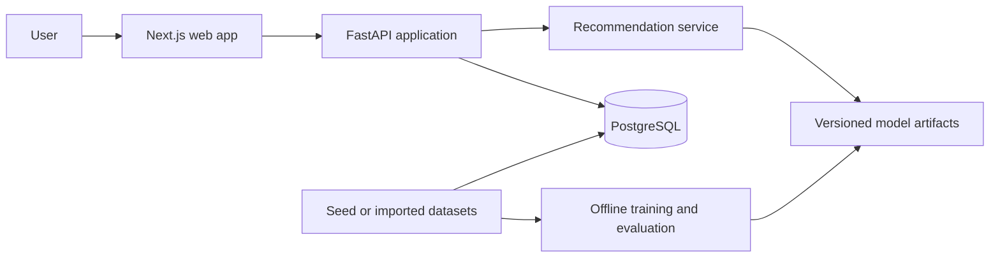

# GameLens AI

GameLens AI is a production-style, full-stack game recommendation portfolio
project. It is designed to demonstrate recommendation-system fundamentals,
data and ML engineering, API and database design, frontend development,
testing, containerization, and reproducible evaluation.

The project will own its ranking logic. External services may later enrich
game metadata, but they will not replace the recommendation engine.

## Current status

**Stage 0 — Repository foundation**

The repository currently provides project boundaries, architecture and data
design documents, local PostgreSQL configuration, environment-variable
examples, and a staged delivery roadmap. Application code begins in Stage 1.

There is no API, frontend, seed dataset, or trained model yet. This is
intentional: commands and components are added only when they are runnable.

## Planned MVP

The first runnable product will let an anonymous development user:

1. Browse a game catalog.
2. Select preferred genres, tags, platforms, and example games.
3. Receive recommendations from a project-owned content model.
4. See structured reasons for each result.
5. Record simple feedback such as liked, disliked, played, or wishlisted.

Authentication, collaborative filtering, external metadata imports, and LLM
explanations are later stages.

## Architecture



The web application, backend, persistent data, and offline ML workflow remain
separate. Training never runs inside an API request. See
[Architecture](docs/architecture.md) for the detailed boundaries.

## Technology direction

| Area | Planned technology |
| --- | --- |
| Web | Next.js, React, TypeScript, Tailwind CSS |
| API | Python, FastAPI, Pydantic |
| Persistence | PostgreSQL, SQLAlchemy 2.x, Alembic |
| ML | pandas, NumPy, scikit-learn, SciPy, joblib |
| Local infrastructure | Docker Compose |
| Quality | pytest, Ruff, strict TypeScript, ESLint |

Exact dependency versions will be selected and locked when each application is
introduced, rather than guessing versions before code exists.

## Repository layout

```text
.
|-- apps/
|   |-- api/                 # FastAPI application from Stage 1
|   `-- web/                 # Next.js application from Stage 2
|-- data/                    # Dataset policy and future seed/import locations
|-- docs/
|   |-- architecture.md
|   |-- data-model.md
|   |-- recommendation-design.md
|   `-- roadmap.md
|-- infra/                   # Infrastructure notes
|-- ml/                      # Offline ML workflow boundary
|-- scripts/                 # Future cross-project task scripts
|-- .env.example
|-- docker-compose.yml       # Stage 0 PostgreSQL service
|-- Makefile                 # Commands that currently work
`-- README.md
```

Each currently empty implementation area contains a short README. Subfolders
such as `data/raw`, `ml/artifacts`, and `.github/workflows` will be created
only when a stage has a real file to place there.

## Prerequisites

- Git
- Docker Desktop with the Docker Compose plugin
- GNU Make is optional; every current Make target has a direct Docker command

Python and Node.js become prerequisites in Stage 1 and Stage 2 respectively.

## Local setup

From the repository root, create a local environment file:

```powershell
Copy-Item .env.example .env
```

On macOS or Linux:

```bash
cp .env.example .env
```

The example credentials are development-only. Change them before using a
shared or remotely accessible database.

Validate and start PostgreSQL:

```powershell
docker compose config
docker compose up -d
docker compose ps
```

Stop the service without deleting its named volume:

```powershell
docker compose down
```

To also remove local database data, explicitly run
`docker compose down --volumes`. That destructive variant is intentionally not
wrapped by the Makefile.

## Root commands

The current Makefile exposes only commands backed by working Stage 0
components:

| Command | Direct equivalent | Purpose |
| --- | --- | --- |
| `make help` | — | List current commands |
| `make config` | `docker compose config` | Validate Compose |
| `make up` | `docker compose up -d` | Start PostgreSQL |
| `make down` | `docker compose down` | Stop PostgreSQL |
| `make logs` | `docker compose logs -f db` | Follow database logs |

Commands such as `migrate`, `seed`, `test`, `lint`, `api`, `web`, `train`, and
`evaluate` will be added only with their corresponding implementation.

## Environment variables

| Variable | Used now | Purpose |
| --- | --- | --- |
| `POSTGRES_DB` | Yes | Local database name |
| `POSTGRES_USER` | Yes | Local database user |
| `POSTGRES_PASSWORD` | Yes | Local development password |
| `POSTGRES_PORT` | Yes | Host port mapped to PostgreSQL |
| `ENVIRONMENT` | Stage 1 | Backend runtime environment |
| `API_HOST` / `API_PORT` | Stage 1 | Backend bind address |
| `DATABASE_URL` | Stage 1 | SQLAlchemy connection URL |
| `CORS_ORIGINS` | Stage 1 | Allowed browser origins |
| `LOG_LEVEL` | Stage 1 | Application log verbosity |
| `NEXT_PUBLIC_API_URL` | Stage 2 | Browser-visible API base URL |

Never commit `.env` or production credentials. Only `.env.example` belongs in
version control.

## Project documentation

- [Architecture](docs/architecture.md)
- [Data model](docs/data-model.md)
- [Recommendation design](docs/recommendation-design.md)
- [Roadmap](docs/roadmap.md)
- [Stage 1 backend and database plan](docs/stage-1-backend-database-plan.md)

## Stage 0 verification

Run the following before considering the repository foundation complete:

```powershell
git diff --check
docker compose config
docker compose up -d
docker compose ps
docker compose down
git check-ignore .env
```

PostgreSQL should become healthy, `.env` should be ignored, and the Compose
configuration should render without an error.

## Current limitations

- No application endpoints or OpenAPI document exist yet.
- No database migrations or seed data exist yet.
- No recommendation model has been trained.
- No external game API or paid service is required.
- No performance or evaluation claims are made.

See the roadmap for the next vertical slice: FastAPI configuration, database
session management, the first migration, a health endpoint, and tests.

## License

This repository is available under the [MIT License](LICENSE). Dataset and
third-party metadata licenses must be documented separately before ingestion.
