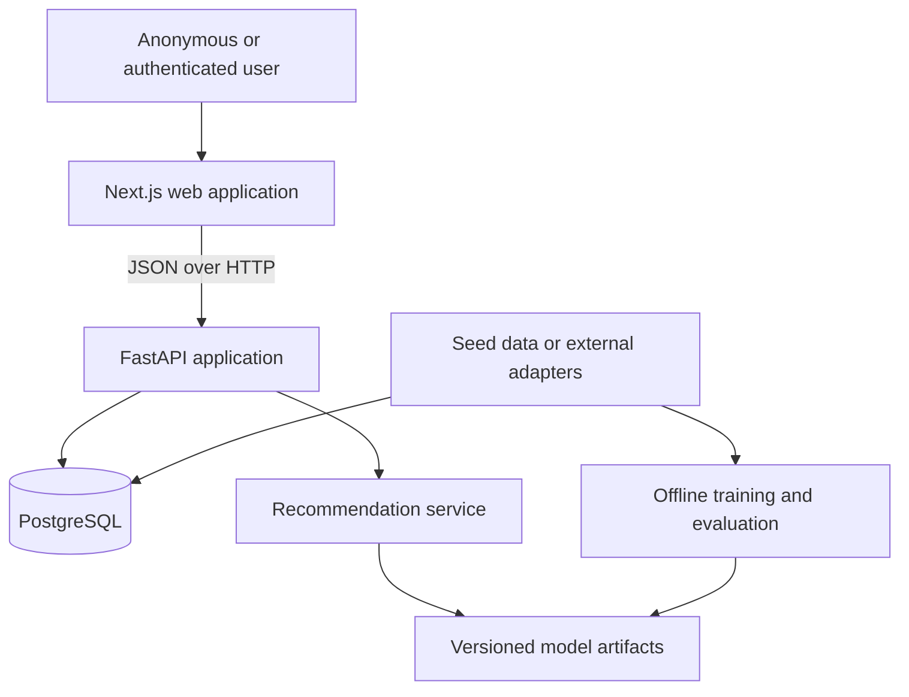

# Architecture

## Goals

GameLens AI uses a modular monorepo so the portfolio demonstrates product,
backend, data, and ML engineering without introducing unnecessary distributed
systems. Each major stage must leave the repository runnable and documented.

The initial architecture favors explicit boundaries, deterministic local data,
replaceable recommendation algorithms, and deployment-neutral containers.

## System context



## Repository boundaries

### Web

`apps/web` owns pages, presentation components, browser state, and a typed API
client. It does not connect directly to PostgreSQL, embed secrets, or implement
recommendation ranking.

### API

`apps/api` owns HTTP contracts, validation, orchestration, persistence, and
online recommendation inference. Route functions remain thin:

```text
route -> service -> repository/model interface -> database or artifact
```

Database sessions are dependency-injected. Database models are not returned
directly as API responses.

### Database

PostgreSQL stores games, taxonomy, users, preferences, interactions, and
recommendation events. Schema changes use Alembic migrations. Flexible JSON
is limited to request context and compact result summaries where a relational
shape would not be stable.

### Machine learning

`ml` owns preprocessing, training, offline evaluation, reproducibility
metadata, and artifact generation. Training is never triggered by a request.
The API loads a known artifact version and exposes its status.

### External data

Future metadata sources sit behind adapters. The local MVP must start from a
deterministic seed dataset and remain usable without network access or API
keys.

## Runtime environments

### Local development

Stage 0 provides PostgreSQL through Docker Compose. Stage 1 will add the API
container while preserving the option to run FastAPI directly on the host.
Stage 2 will add the web development server.

### Production direction

The intended deployment is a Node-compatible web host, a containerized API,
and managed PostgreSQL. The repository must not depend on a specific vendor.

## Cross-cutting decisions

- Configuration comes from environment variables.
- Timestamps are stored in UTC.
- CORS uses an explicit configured allowlist.
- Secrets and local datasets are excluded from version control.
- Structured logging and centralized error handling begin in Stage 1.
- Model names, versions, and component scores remain observable.
- Authentication is deferred, but user identifiers are not embedded into
  recommendation algorithms.

## Current state

Only the repository foundation and local PostgreSQL definition exist in Stage
0. Diagrammed application components describe accepted boundaries, not
already implemented functionality.
