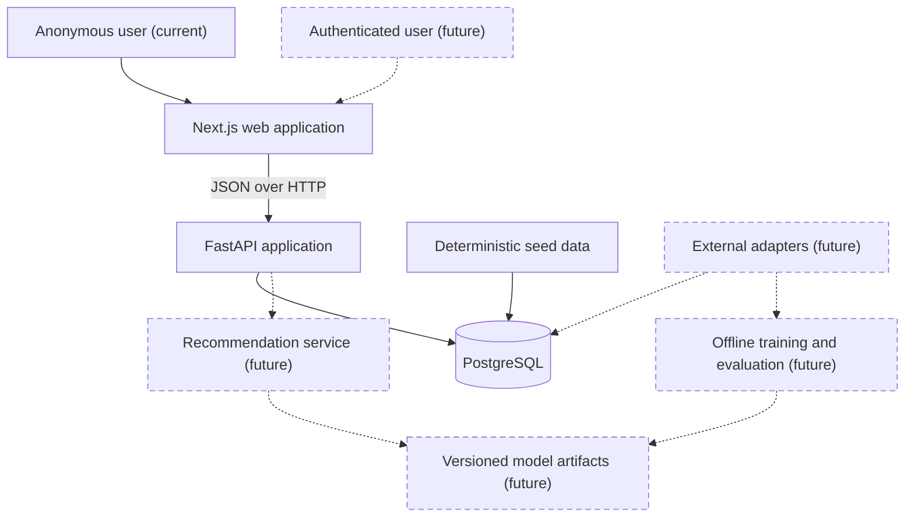

# Architecture

## Goals

GameLens AI uses a modular monorepo so the portfolio demonstrates product,
backend, data, and ML engineering without introducing unnecessary distributed
systems. Each major stage must leave the repository runnable and documented.

The initial architecture favors explicit boundaries, deterministic local data,
replaceable recommendation algorithms, and deployment-neutral containers.

## System context



### Planned Stage 3 activation

Stage 3 will activate the existing dashed recommendation boundary through an
explicit offline-to-online artifact flow:

```mermaid
flowchart LR
    DB[("Migrated and seeded PostgreSQL")]
    Snapshot["Canonical read-only catalog snapshot"]
    Builder["Offline popularity and TF-IDF builder"]
    Artifact["Validated versioned sparse artifact"]
    Loader["API lifecycle loader"]
    Ranker["Immutable online ranker"]
    API["FastAPI recommendation use case"]
    Web["Anonymous onboarding and results"]

    DB --> Snapshot
    Snapshot --> Builder
    Builder --> Artifact
    Artifact --> Loader
    Loader --> Ranker
    Web -->|"Bounded preference context"| API
    API -->|"Read one consistent catalog snapshot"| DB
    API --> Ranker
    Ranker -->|"Ranked items and structured evidence"| API
    API --> Web
```



The browser will not import or execute ranking code. Artifact building remains
an explicit offline command, while API startup only validates and loads the
intrinsic contents of an already built bundle. Model-status and recommendation
requests compare that immutable artifact with one transactionally consistent
current-catalog snapshot before reporting `ready` or ranking. Missing, corrupt,
incompatible, or catalog-stale artifacts leave catalog behavior available and
recommendation capability unavailable. See the
[Stage 3 engineering plan](stage-3-content-recommendation-mvp-plan.md).

## Repository boundaries

### Web

`apps/web` owns pages, presentation components, browser state, and a typed API
client. It does not connect directly to PostgreSQL, embed secrets, or implement
recommendation ranking.

Stage 2 implements Next.js App Router routes for `/`, `/games`, and
`/games/[gameId]`. The root layout and landing page are statically rendered;
focused catalog and detail client components own browser-side API requests and
interactive state. Catalog request state is normalized into URL search
parameters so reload and browser history restore the same request without a
global store.

All browser requests pass through one project-owned client configured by the
validated `NEXT_PUBLIC_API_URL`. Its compile-time contracts are generated from
the live FastAPI OpenAPI document and checked for drift. The runtime boundary
also verifies JSON responses and the standard API error envelope. There is no
backend-for-frontend, internal API URL, direct database access, or browser-side
ranking logic. See the completed
[Stage 2 frontend engineering plan](stage-2-frontend-foundation-plan.md).

### API

`apps/api` owns HTTP contracts, validation, orchestration, and persistence. The
Stage 3 plan adds online inference only after an explicit offline build
produces an artifact whose integrity, compatibility, and current-catalog
fingerprint pass validation. The current implementation still uses the
`not_configured` placeholder. Route functions remain thin:

```text
route -> service -> repository/model interface -> database or artifact
```

Database sessions are dependency-injected from the app-local engine, which is
also used by readiness checks and disposed at shutdown. Database models are
not returned directly as API responses.

### Database

PostgreSQL stores games, taxonomy, users, preferences, interactions, and
recommendation events. Schema changes use Alembic migrations. Flexible JSON
is limited to request context and compact result summaries where a relational
shape would not be stable.

### Machine learning

`ml` owns preprocessing, the popularity baseline, TF-IDF feature construction,
pure ranking logic, reproducibility metadata, artifact generation, and later
offline evaluation. Stage 3 will keep the catalog matrix sparse and key
artifact rows by stable game slug. Training is never triggered by a request or
ordinary application startup. The API will load one known validated artifact
version, compare it with the current catalog, and expose an honest
unconfigured, unavailable, or ready status.

### External data

Future metadata sources sit behind adapters. The local MVP must start from a
deterministic seed dataset and remain usable without network access or API
keys.

## Runtime environments

### Local development

Docker Compose provides PostgreSQL, the FastAPI service, and the Next.js
development server while preserving direct host workflows for both
applications. Schema migration and deterministic seeding remain explicit
commands; starting the web service never changes database state.

The web service bind-mounts `apps/web` for source edits and uses separate named
volumes for Linux `node_modules` and `.next` data. It publishes only to
`127.0.0.1` and waits for API readiness. Startup compares the bind-mounted and
image lockfiles, refreshes stale dependencies from the built image, repairs
volume ownership, clears invalidated Next.js cache data, and then runs the
development server as the non-root `node` user. A separate E2E Compose project
uses a `tmpfs` PostgreSQL database, applies migrations and seed data explicitly,
and runs the locked Playwright suite without touching the persistent
development database volume.

### Production direction

The intended deployment is a Node-compatible web host, a containerized API,
and managed PostgreSQL. The repository must not depend on a specific vendor.
The current social metadata base is the local development origin; Stage 7 must
add and validate the public site origin before deployment.

## Cross-cutting decisions

- Configuration comes from environment variables.
- Timestamps are stored in UTC.
- CORS uses an explicit configured allowlist.
- Secrets and local datasets are excluded from version control.
- Structured logging and centralized error handling begin in Stage 1.
- Model names, versions, and component scores remain observable.
- Authentication is deferred, but user identifiers are not embedded into
  recommendation algorithms.

## Current state

Stages 1 and 2 implement the API, database, and web boundaries. Catalog routes
depend on services, repositories, and injected SQLAlchemy sessions; PostgreSQL
is the runtime source of truth. Readiness requires connectivity and the
expected Alembic schema head. The responsive web application supports catalog
search, filters, sorting, pagination, and game details with explicit loading,
empty, unavailable, not-found, and nullable-field states.

The recommendation boundary still exposes only the honest `not_configured`
status. The Stage 3 engineering plan is ready, but its anonymous onboarding,
active recommender, offline builder, model artifact, recommendation endpoint,
and result experience have not been implemented. Authentication, persisted
preferences, feedback, recommendation-event logging, and production deployment
remain later components.
