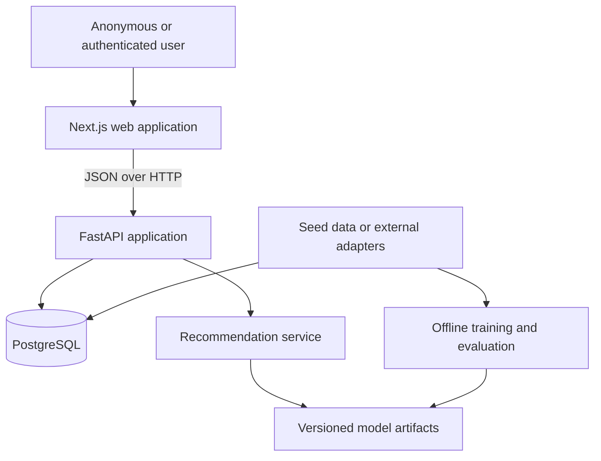

# Architecture

## Goals

GameLens AI uses a modular monorepo so the portfolio demonstrates product,
backend, data, and ML engineering without introducing unnecessary distributed
systems. Each major stage must leave the repository runnable and documented.

The initial architecture favors explicit boundaries, deterministic local data,
replaceable recommendation algorithms, and deployment-neutral containers.

## System context



## Repository boundaries

### Web

`apps/web` owns pages, presentation components, browser state, and a typed API
client. It does not connect directly to PostgreSQL, embed secrets, or implement
recommendation ranking.

The planned Stage 2 boundary uses Next.js App Router routes for `/`, `/games`,
and `/games/[gameId]`. Catalog request state lives in URL search parameters.
Focused catalog and detail client components will call FastAPI through one
project-owned typed client that consumes OpenAPI-derived contracts and is
configured by `NEXT_PUBLIC_API_URL`. The plan does not introduce a
backend-for-frontend, server-side catalog fetch, internal API URL, or global
state store. These decisions are targets, not implemented behavior; see the
[Stage 2 frontend engineering plan](stage-2-frontend-foundation-plan.md).

### API

`apps/api` owns HTTP contracts, validation, orchestration, persistence, and
online recommendation inference. Route functions remain thin:

```text
route -> service -> repository/model interface -> database or artifact
```

Database sessions are dependency-injected from the app-local engine, which is
also used by readiness checks and disposed at shutdown. Database models are
not returned directly as API responses.

### Database

PostgreSQL stores games, taxonomy, users, preferences, interactions, and
recommendation events. Schema changes use Alembic migrations. Flexible JSON
is limited to request context and compact result summaries where a relational
shape would not be stable.

### Machine learning

`ml` owns preprocessing, training, offline evaluation, reproducibility
metadata, and artifact generation. Training is never triggered by a request.
The API loads a known artifact version and exposes its status.

### External data

Future metadata sources sit behind adapters. The local MVP must start from a
deterministic seed dataset and remain usable without network access or API
keys.

## Runtime environments

### Local development

Docker Compose provides PostgreSQL and the Stage 1 API container while
preserving the option to run FastAPI directly on the host. Schema migration
and deterministic seeding remain explicit commands. Stage 2 implementation
will add a web development server while keeping those lifecycle operations
explicit.

### Production direction

The intended deployment is a Node-compatible web host, a containerized API,
and managed PostgreSQL. The repository must not depend on a specific vendor.

## Cross-cutting decisions

- Configuration comes from environment variables.
- Timestamps are stored in UTC.
- CORS uses an explicit configured allowlist.
- Secrets and local datasets are excluded from version control.
- Structured logging and centralized error handling begin in Stage 1.
- Model names, versions, and component scores remain observable.
- Authentication is deferred, but user identifiers are not embedded into
  recommendation algorithms.

## Current state

Stage 1 implements the API and database boundaries. Catalog routes depend on
services, repositories, and injected SQLAlchemy sessions; PostgreSQL is the
runtime source of truth. Readiness requires both connectivity and the expected
Alembic schema head. The recommendation boundary currently exposes only an
honest `not_configured` status. The web application, active recommender,
training pipeline, and model artifacts remain future components. The Stage 2
frontend plan is ready, but no web application code or service exists yet.
