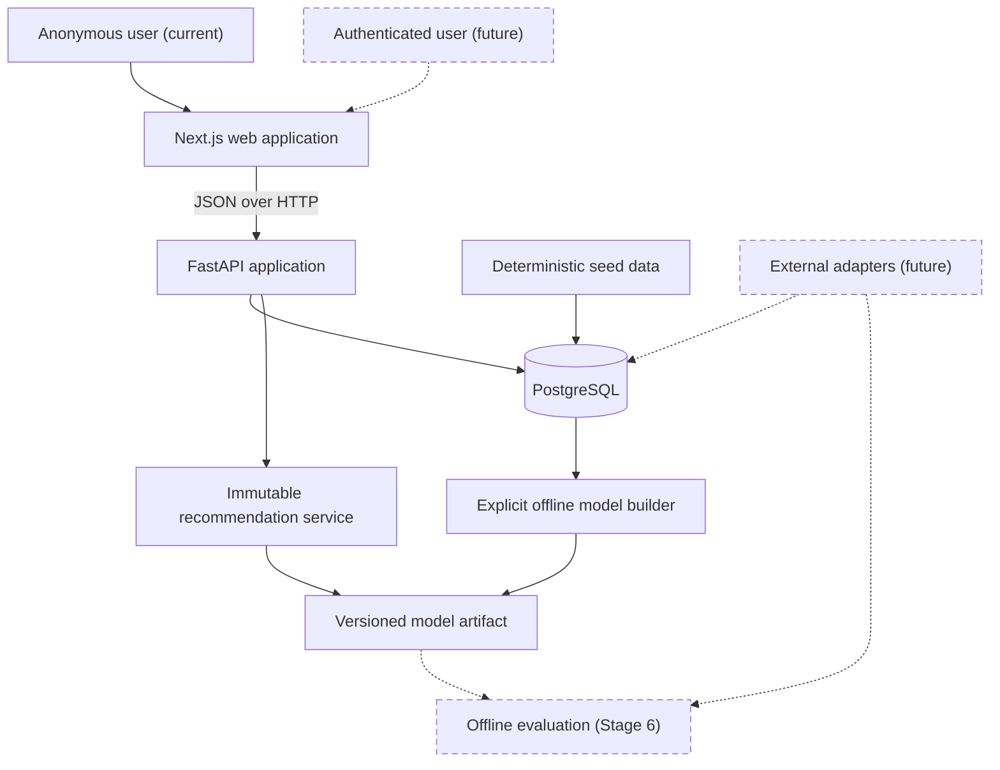
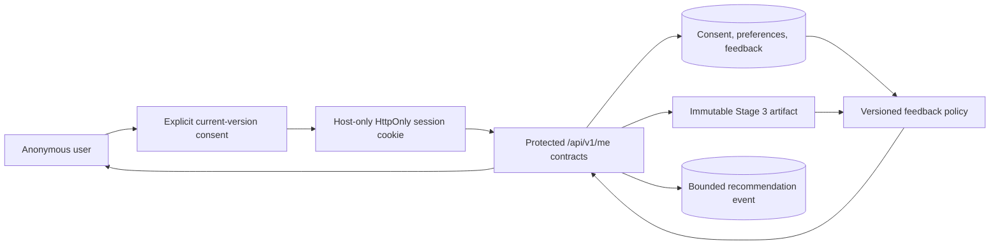

```mermaid
flowchart LR
    DB[("Migrated and seeded PostgreSQL")]
    Snapshot["Canonical read-only catalog snapshot"]
    Builder["Offline popularity and TF-IDF builder"]
    Artifact["Validated versioned sparse artifact"]
    Loader["API lifecycle loader"]
    Ranker["Immutable online ranker"]
    API["FastAPI recommendation use case"]
    Web["Anonymous onboarding and results"]

    DB --> Snapshot
    Snapshot --> Builder
    Builder --> Artifact
    Artifact --> Loader
    Loader --> Ranker
    Web -->|"Bounded preference context"| API
    API -->|"Read one consistent catalog snapshot"| DB
    API --> Ranker
    Ranker -->|"Ranked items and structured evidence"| API
    API --> Web
```

# Architecture

## Goals

GameLens AI uses a modular monorepo so the portfolio demonstrates product,
backend, data, and ML engineering without introducing unnecessary distributed
systems. Each major stage must leave the repository runnable and documented.

The initial architecture favors explicit boundaries, deterministic local data,
replaceable recommendation algorithms, and deployment-neutral containers.

## System context



### Implemented Stage 3 activation

Stage 3 activates the recommendation boundary through an explicit
offline-to-online artifact flow:



The browser does not import or execute ranking code. Artifact building remains
an explicit offline command, while API startup only validates and loads the
intrinsic contents of an already built bundle. Model-status and recommendation
requests compare that immutable artifact with one transactionally consistent
current-catalog snapshot before reporting `ready` or ranking. Missing, corrupt,
incompatible, or catalog-stale artifacts and catalogs that cannot be
canonicalized leave catalog behavior available and recommendation capability
unavailable. The latter is reported as `catalog_invalid`. See the
[Stage 3 engineering plan](stage-3-content-recommendation-mvp-plan.md).

### Planned Stage 4 activation

The
[Stage 4 feedback-and-persistence plan](stage-4-feedback-persistence-plan.md)
adds a separate explicit-consent path without changing the Stage 3 stateless
route:



Only the session-creation contract may create identity. The raw token remains
in the browser cookie; PostgreSQL will store a keyed digest plus explicit
consent and expiry. Protected unsafe requests will use exact-origin,
credentialed CORS, and CSRF checks. Saved preferences and temporal feedback
remain user-scoped relational state and never enter the artifact.

The stateless endpoint retains one repeatable-read read-only snapshot. The
planned personalized endpoint owns one bounded repeatable-read read-write
transaction from identity/context resolution through ranking and insertion of
the exact matching model/data/policy-versioned event. Deletion and explicit
retention remove user-owned state through tested cascades. None of this Stage 4
runtime behavior is implemented merely because the plan is ready.

## Repository boundaries

### Web

`apps/web` owns pages, presentation components, browser state, and a typed API
client. It does not connect directly to PostgreSQL, embed secrets, or implement
recommendation ranking.

Stages 2 and 3 implement Next.js App Router routes for `/`, `/games`,
`/games/[gameId]`, and `/recommendations`. The root layout and landing page are statically rendered;
focused catalog and detail client components own browser-side API requests and
interactive state. Catalog request state is normalized into URL search
parameters so reload and browser history restore the same request without a
global store. Recommendation selections deliberately remain local to one
select-review-results flow and are discarded on restart or navigation.

Stage 4 plans an opt-in durable branch of `/recommendations` with consent,
rehydration, feedback, expiry, and clear-data states. The opt-out branch will
retain the current request-only behavior. Credentials remain in an HttpOnly
cookie; profile data will not be copied into URLs or browser persistent
storage, and the browser will continue to render rather than calculate ranks.

All browser requests pass through one project-owned client configured by the
validated `NEXT_PUBLIC_API_URL`. Its compile-time contracts are generated from
the live FastAPI OpenAPI document and checked for drift. The runtime boundary
also verifies JSON responses and the standard API error envelope. There is no
backend-for-frontend, internal API URL, direct database access, or browser-side
ranking logic. See the completed
[Stage 2 frontend engineering plan](stage-2-frontend-foundation-plan.md).

### API

`apps/api` owns HTTP contracts, validation, orchestration, and persistence.
Online inference activates only after an explicit offline build produces an
artifact whose integrity, compatibility, and current-catalog fingerprint pass
validation. Absent configuration remains `not_configured`; a configured load
failure, catalog mismatch, or catalog canonicalization failure is
`unavailable`; the last condition uses `catalog_invalid`. Route functions
remain thin:

```text
route -> service -> repository/model interface -> database or artifact
```

Database sessions are dependency-injected from the app-local engine, which is
also used by readiness checks and disposed at shutdown. Database models are
not returned directly as API responses. Recommendation status and execution
read one eager `REPEATABLE READ, READ ONLY` snapshot and compare its canonical
fingerprint with the immutable startup artifact before returning ready data.

Stage 4 plans protected `/api/v1/me` contracts whose application services own
identity, validation, locking, transaction, persistence, and event semantics.
This new read-write path will not weaken the existing stateless read-only path.
Routes remain thin and repositories remain explicitly user-scoped.

### Database

PostgreSQL stores games, taxonomy, users, preferences, interactions, and
recommendation events. Schema changes use Alembic migrations. Flexible JSON
is limited to request context and compact result summaries where a relational
shape would not be stable.

Stage 4 plans to replace plaintext anonymous-key semantics with a consented,
expiring token digest; add temporal active/superseded interaction rules; and
extend recommendation events with data and personalization-policy identity.
Legacy placeholder rows must be preserved but cannot be treated as consented
sessions.

### Machine learning

`ml` owns preprocessing, the popularity baseline, TF-IDF feature construction,
pure ranking logic, reproducibility metadata, artifact generation, and later
offline evaluation. The implemented matrix is float64 CSR keyed by stable game
slug. Transparent JSON/NPY members have manifest sizes and checksums and are
loaded with pickle disabled under explicit resource caps. The loader rejects
non-canonical CSR indices, negative feature weights, IDF weights below one,
and feature rows that are not L2-normalized. Loader-policy changes require
operators to rotate the configured path and rebuild and validate the immutable
artifact before an API restart. Training is never triggered by a request or
ordinary application startup. The API loads one known validated artifact version and exposes an
honest unconfigured, unavailable, or ready status.

The planned feedback policy will consume bounded saved/interaction context as
per-request immutable input, use existing artifact vectors, and expose its own
identity and contribution. User identity and mutable state will never be
written into an artifact or application-lifecycle ranker singleton.

### External data

Future metadata sources sit behind adapters. The local MVP must start from a
deterministic seed dataset and remain usable without network access or API
keys.

## Runtime environments

### Local development

Docker Compose provides PostgreSQL, the FastAPI service, and the Next.js
development server while preserving direct host workflows for both
applications. Schema migration and deterministic seeding remain explicit
commands; starting the web service never changes database state.

The web service bind-mounts `apps/web` for source edits and uses separate named
volumes for Linux `node_modules` and `.next` data. It publishes only to
`127.0.0.1` and waits for API readiness. Startup compares the bind-mounted and
image lockfiles, refreshes stale dependencies from the built image, repairs
volume ownership, clears invalidated Next.js cache data, and then runs the
development server as the non-root `node` user. A separate E2E Compose project
uses a `tmpfs` PostgreSQL database, applies migrations and seed data explicitly,
and runs the locked Playwright suite without touching the persistent
development database volume. Stage 3 adds a disposable named artifact volume:
a short root init changes only that new volume's ownership, the builder runs
non-root, and the API mounts the result read-only. E2E teardown removes this
isolated volume.

### Production direction

The intended deployment is a Node-compatible web host, a containerized API,
and managed PostgreSQL. The repository must not depend on a specific vendor.
The current social metadata base is the local development origin; Stage 7 must
add and validate the public site origin before deployment.

## Cross-cutting decisions

- Configuration comes from environment variables.
- Timestamps are stored in UTC.
- CORS uses an explicit configured allowlist.
- Secrets and local datasets are excluded from version control.
- Structured logging and centralized error handling begin in Stage 1.
- Model names, versions, and component scores remain observable.
- Account authentication remains deferred. Stage 4 plans only a
  possession-based anonymous session credential, and user identifiers are not
  embedded into recommendation algorithms.

## Current state

Stages 1 through 3 implement the API, database, web, and ML boundaries. Catalog routes
depend on services, repositories, and injected SQLAlchemy sessions; PostgreSQL
is the runtime source of truth. Readiness requires connectivity and the
expected Alembic schema head. The responsive web application supports catalog
search, filters, sorting, pagination, and game details with explicit loading,
empty, unavailable, not-found, and nullable-field states.

The recommendation boundary now exposes honest `ready`, `not_configured`, and
`unavailable` states plus the bounded `POST /api/v1/recommendations` vertical
slice. The offline builder, checksum-validated artifact, immutable ranker,
generated browser contract, and anonymous explained-result experience are
active. Authentication, persisted preferences, feedback,
recommendation-event logging, formal evaluation, and production deployment
remain later components.

The Stage 4 engineering plan is ready, but its consented identity, durable
preferences, feedback writes/adjustments, event logging, retention operations,
and persistent browser experience have not been implemented.
