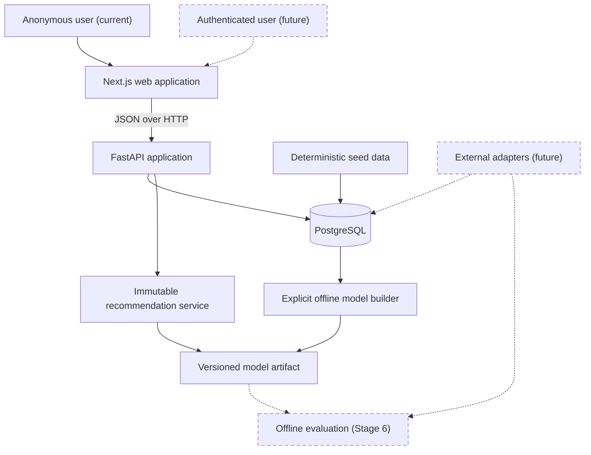
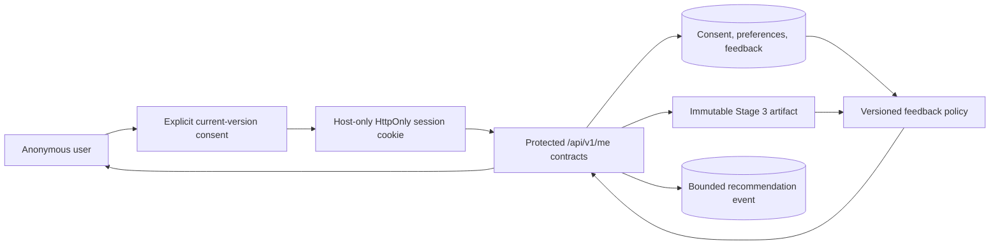
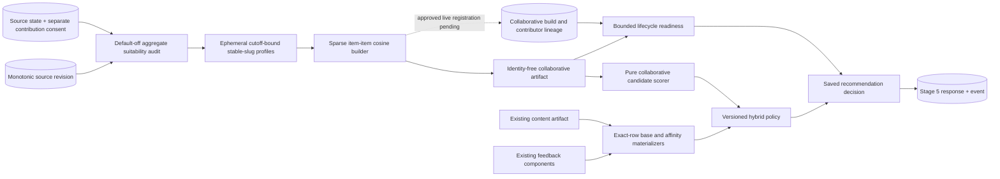

```mermaid
flowchart LR
    DB[("Migrated and seeded PostgreSQL")]
    Snapshot["Canonical read-only catalog snapshot"]
    Builder["Offline popularity and TF-IDF builder"]
    Artifact["Validated versioned sparse artifact"]
    Loader["API lifecycle loader"]
    Ranker["Immutable online ranker"]
    API["FastAPI recommendation use case"]
    Web["Anonymous onboarding and results"]

    DB --> Snapshot
    Snapshot --> Builder
    Builder --> Artifact
    Artifact --> Loader
    Loader --> Ranker
    Web -->|"Bounded preference context"| API
    API -->|"Read one consistent catalog snapshot"| DB
    API --> Ranker
    Ranker -->|"Ranked items and structured evidence"| API
    API --> Web
```

# Architecture

## Goals

GameLens AI uses a modular monorepo so the portfolio demonstrates product,
backend, data, and ML engineering without introducing unnecessary distributed
systems. Each major stage must leave the repository runnable and documented.

The initial architecture favors explicit boundaries, deterministic local data,
replaceable recommendation algorithms, and deployment-neutral containers.

## System context



### Implemented Stage 3 activation

Stage 3 activates the recommendation boundary through an explicit
offline-to-online artifact flow:



The browser does not import or execute ranking code. Artifact building remains
an explicit offline command, while API startup only validates and loads the
intrinsic contents of an already built bundle. Model-status and recommendation
requests compare that immutable artifact with one transactionally consistent
current-catalog snapshot before reporting `ready` or ranking. Missing, corrupt,
incompatible, or catalog-stale artifacts and catalogs that cannot be
canonicalized leave catalog behavior available and recommendation capability
unavailable. The latter is reported as `catalog_invalid`. See the
[Stage 3 engineering plan](stage-3-content-recommendation-mvp-plan.md).

### Stage 4 activation (verified 2026-08-13)

The
[Stage 4 feedback-and-persistence plan](stage-4-feedback-persistence-plan.md)
implements a separate explicit-consent path without changing the Stage 3
stateless route:



Only the session-creation contract may create identity. The raw token remains in
the host-only HttpOnly browser cookie; PostgreSQL stores a domain-separated
HMAC-SHA-256 digest plus explicit consent, expiry, and revocation state.
Protected unsafe requests use exact-origin, credentialed CORS, and CSRF checks.
Saved preferences and temporal feedback remain user-scoped relational state and
never enter the artifact.

The stateless endpoint retains one repeatable-read read-only snapshot. The
personalized endpoint owns one bounded repeatable-read read-write transaction
from identity/context resolution through ranking and insertion of the exact
matching model/data/policy-versioned event. Deletion and explicit retention
remove user-owned state through relational cascades. Fast tests cover the
application boundaries, and 49 disposable-PostgreSQL integration tests verify
the Stage 4 schema, populated legacy upgrade, transaction/concurrency,
event/delete correlation, cascades, and retention behavior.

### Stage 5 Phase 0–6 synchronized saved contract implemented; lifecycle commands pending

The
[Stage 5 collaborative-and-hybrid plan](stage-5-collaborative-hybrid-ranking-plan.md)
defines a second offline-to-online path. Phases 0–4 implement the default-off
contribution/revision contract, aggregate audit, fixture-guarded artifact, pure
scorer/materializers, and versioned hybrid policy. Phase 5 adds the immutable
optional application component, protected build/contributor lineage,
transactional invalidation, one-row request readiness, additive model status,
and saved-request orchestration. Phase 6 projects that decision once into an
additive saved response and matching bounded `stage-5-v1` event, regenerates the
browser contract, and renders server-owned hybrid/fallback evidence. Phase 7
still owns deliberate live lifecycle commands and any separately approved
contribution flow.

The implemented read-only UCSD Steam preflight is a separate offline source
identity, preparation, and aggregate-support check. It is not connected to the
first-party path and remains explicitly not integrated.



The implemented extractor reads eligible state in one database-time
`REPEATABLE READ, READ ONLY` transaction, captures the revision and exact
catalog fingerprint, discards transient internal IDs, and writes no row-level
snapshot. Source mutations advance the PostgreSQL revision, while recommendation
events do not.

The Phase 2 builder writes a separate immutable identity-free bundle, validates
the temporary sibling through the production loader, supports a last-moment
revision callback for live metadata, and promotes only to an unused path. The
operator CLI deliberately exposes only the guarded authored fixture. Phase 5
persists live build/contributor lineage and invalidates affected builds on
authority or included-label loss, but approved live build registration,
promotion, rollback, retirement commands, and physical cleanup remain later
work. Configuration keeps live access default-off. No request, startup, or
ordinary migration trains a model.

## Repository boundaries

### Web

`apps/web` owns pages, presentation components, browser state, and a typed API
client. It does not connect directly to PostgreSQL, embed secrets, or implement
recommendation ranking.

Stages 2 and 3 implement Next.js App Router routes for `/`, `/games`,
`/games/[gameId]`, and `/recommendations`. The root layout and landing page are
statically rendered; focused catalog and detail client components own
browser-side API requests and interactive state. Catalog request state is
normalized into URL search parameters so reload and browser history restore the
same request without a global store. Recommendation selections deliberately
remain local to one select-review-results flow and are discarded on restart or
navigation.

Stage 4 adds an opt-in durable branch of `/recommendations` with consent,
rehydration, feedback, expiry, and clear-data states. The opt-out branch retains
the request-only behavior. Credentials remain in an HttpOnly cookie; profile
data is not copied into URLs or Web Storage, and the browser renders rather than
calculates ranks. Component and client tests pass. The full-Chromium and
critical Firefox/WebKit acceptance matrix passes 38/38 in 1.3 minutes without
retry against the exact-host `gamelens.test` topology.

Stage 5 Phase 6 evolves only that saved branch. A dedicated result component
renders the server-provided `hybrid` or `stage_4_fallback` mode, preserves item
order, and exposes aggregate support/source edges only when a positive
collaborative contribution was applied. Loading, valid-empty, error/retry,
focus, live-region, responsive, and forced-colors behavior is component-tested;
ordinary UI omits model fingerprints and contributor/lineage identity.

All browser requests pass through one project-owned client configured by the
validated `NEXT_PUBLIC_API_URL`. Its compile-time contracts are generated from
the live FastAPI OpenAPI document and checked for drift. The runtime boundary
also verifies JSON responses and the standard API error envelope. There is no
backend-for-frontend, internal API URL, direct database access, or browser-side
ranking logic. See the completed
[Stage 2 frontend engineering plan](stage-2-frontend-foundation-plan.md).

### API

`apps/api` owns HTTP contracts, validation, orchestration, and persistence.
Online inference activates only after an explicit offline build produces an
artifact whose integrity, compatibility, and current-catalog fingerprint pass
validation. Absent configuration remains `not_configured`; a configured load
failure, catalog mismatch, or catalog canonicalization failure is `unavailable`;
the last condition uses `catalog_invalid`. Route functions remain thin:

```text
route -> service -> repository/model interface -> database or artifact
```

Database sessions are dependency-injected from the app-local engine, which is
also used by readiness checks and disposed at shutdown. Database models are not
returned directly as API responses. Recommendation status and execution read one
eager `REPEATABLE READ, READ ONLY` snapshot and compare its canonical
fingerprint with the immutable startup artifact before returning ready data.

Stage 4 implements protected `/api/v1/me`, `/api/v1/me/preferences`,
`/api/v1/me/feedback`, `/api/v1/me/games/{game_id}/feedback`, and
`/api/v1/me/recommendations` contracts. Application services own identity,
validation, locking, transaction, persistence, and event semantics. This
read-write path does not replace the stateless read-only path. Routes remain
thin and repositories remain explicitly user-scoped.

Stage 5 Phase 5 injects a second immutable component and hybrid orchestrator
only into saved personalization. The request resolves collaborative readiness
inside the same repeatable-read transaction from database time plus at most one
registry row, then computes a typed `hybrid` or `stage_4_fallback` decision.
Phase 6 maps that immutable decision through one projector to the additive
public response and compact `stage-5-v1` event without a second ranking call.
Commit/acknowledgement and ambiguous-outcome semantics remain unchanged. The
stateless route never reads collaborative lineage.

### Database

PostgreSQL stores games, taxonomy, users, preferences, interactions,
recommendation events, optional collaborative contribution consent, and one
monotonic collaborative source revision. Schema changes use Alembic migrations.
Flexible JSON is limited to request context and compact result summaries where a
relational shape would not be stable.

Stage 4 migrations replace plaintext anonymous-key semantics with a consented,
expiring token digest, add temporal active/superseded interaction rules, and
extend recommendation events with data and personalization-policy identity. The
expected Alembic head is `0010_stage_5_event_contract`. Legacy placeholder rows
are deterministically converted to unique revoked, inaccessible identities and
are not treated as consented sessions. The populated `0002` to head upgrade and
the documented populated downgrade/re-upgrade gate pass in the disposable
PostgreSQL suite. The Stage 5 migration grants no contribution consent to
existing users and adds statement-level revision triggers for source/catalog
tables only. Revisions `0007`–`0009` add live artifact build and contributor
lineage, enforce contributor authority, maintain aggregate contributor counts,
and invalidate affected active builds transactionally when authority or an
included positive label is removed or changed. Revision `0010` preserves
legacy/Stage 4 event rows and adds all-or-none Stage 5 mode, fallback, hybrid,
collaborative identity, and bounded result constraints. Recommendation events
remain generation audit records and are not a revision or label source.

### Machine learning

`ml` owns preprocessing, the popularity baseline, TF-IDF feature construction,
pure ranking logic, reproducibility metadata, artifact generation, and later
offline evaluation. The implemented matrix is float64 CSR keyed by stable game
slug. Transparent JSON/NPY members have manifest sizes and checksums and are
loaded with pickle disabled under explicit resource caps. The loader rejects
non-canonical CSR indices, negative feature weights, IDF weights below one, and
feature rows that are not L2-normalized. Loader-policy changes require operators
to rotate the configured path and rebuild and validate the immutable artifact
before an API restart. Training is never triggered by a request or ordinary
application startup. The API loads one known validated artifact version and
exposes an honest unconfigured, unavailable, or ready status.

The implemented `gamelens-feedback-adjustment/1.0.0` policy consumes bounded
saved/interaction context as immutable per-request input, uses existing artifact
vectors, and exposes its own identity and contribution. User identity and
mutable state never enter an artifact or the application-lifecycle ranker
singleton. The Stage 3 model and artifact identity remain unchanged.

Stage 5 Phase 0–6 adds canonical sorted-profile serialization, fixed
fingerprinting, bounded support/pair aggregates, a strict synthetic fixture
loader, and a separate sparse item-item cosine artifact. The trainer receives
only canonical ephemeral profiles and stable-slug catalog identity. The bundle
contains aggregate item neighborhoods, support, fingerprints, configuration,
lifecycle metadata, and checksums—not contributor rows, IDs, token digests, or
recommendation events. Strict JSON/NPY parsing, exact member checks, immutable
arrays, and validity checks form a separate trust boundary from the content
artifact.

Phase 3 consumes that validated artifact through canonical source selection,
exact bounded CSR row traversal, fixed-point aggregation, typed support reasons,
and reconstructible source-edge evidence. Exact-row base and affinity seams
permit a zero-content collaborative candidate to reach the Phase 4 boundary
without changing the existing Stage 3/4 wrappers. The scorer has no database,
HTTP, lifecycle, fallback, or hybrid dependency.

Phase 4 joins content and collaborative candidates by stable slug before final
top-K, applies versioned fixed-point base, feedback-affinity, collaborative, and
played contributions, and materializes reconstructible structured evidence. The
public ML orchestrator returns the unchanged Stage 4 result under an explicit
fallback wrapper for every typed unavailable or no-support outcome. Phase 5's
application boundary loads the optional component once, maps artifact/registry
facts to bounded readiness, and invokes this policy from the saved request.
Phase 6 exposes its decision through synchronized public response/event records
and generated-client/UI evidence; formal ranking evaluation stays in roadmap
Stage 6. Fixture readiness is functional evidence only and does not approve a
live cohort.

### External data

Future metadata sources sit behind adapters. The local MVP must start from a
deterministic seed dataset and remain usable without network access or API keys.

## Runtime environments

### Local development

Docker Compose provides PostgreSQL, the FastAPI service, and the Next.js
development server while preserving direct host workflows for both applications.
Schema migration and deterministic seeding remain explicit commands; starting
the web service never changes database state.

The web service bind-mounts `apps/web` for source edits and uses separate named
volumes for Linux `node_modules` and `.next` data. It publishes only to
`127.0.0.1` and waits for API readiness. Startup compares the bind-mounted and
image lockfiles, refreshes stale dependencies from the built image, repairs
volume ownership, clears invalidated Next.js cache data, and then runs the
development server as the non-root `node` user. A separate E2E Compose project
uses a `tmpfs` PostgreSQL database, applies migrations and seed data explicitly,
and runs the locked Playwright suite without touching the persistent development
database volume. Stage 3 adds a disposable named artifact volume: a short root
init changes only that new volume's ownership, the builder runs non-root, and
the API mounts the result read-only. E2E teardown removes this isolated volume.

### Production direction

The intended deployment is a Node-compatible web host, a containerized API, and
managed PostgreSQL. The repository must not depend on a specific vendor. The
current social metadata base is the local development origin; Stage 7 must add
and validate the public site origin before deployment.

## Cross-cutting decisions

- Configuration comes from environment variables.
- Timestamps are stored in UTC.
- CORS uses an explicit configured allowlist.
- Secrets and local datasets are excluded from version control.
- Structured logging and centralized error handling begin in Stage 1.
- Model names, versions, and component scores remain observable.
- Account authentication remains deferred. Stage 4 implements only a
  possession-based anonymous session credential, and user identifiers are not
  embedded into recommendation algorithms.

## Current state

Stages 1 through 4 implement the API, database, web, ML, consent, and saved
personalization boundaries. Catalog routes depend on services, repositories, and
injected SQLAlchemy sessions; PostgreSQL is the runtime source of truth.
Readiness requires connectivity and the expected Alembic schema head. The
responsive web application supports catalog search, filters, sorting,
pagination, game details, request-only recommendations, and opt-in saved
personalization with explicit loading, empty, unavailable, not-found, consent,
expiry, and deletion states.

The recommendation boundary now exposes honest `ready`, `not_configured`, and
`unavailable` states plus the bounded `POST /api/v1/recommendations` vertical
slice. The offline builder, checksum-validated artifact, immutable ranker,
generated browser contract, and anonymous explained-result experience are
active. Account authentication, approved live collaborative training, formal
evaluation, and production deployment remain later components. Stage 5 now has
Phases 0–6: interaction audit, offline collaborative artifact, pure scoring and
materialization, versioned hybrid policy, protected live lifecycle lineage,
bounded component readiness, additive model status, saved-request orchestration,
synchronized response/event projection, generated client fields, and cautious
browser evidence. Approved live promotion, contribution-consent product flow,
and lifecycle operator commands are not implemented.

The Phase 6 handoff passes 365 API unit tests, 109 disposable-PostgreSQL tests,
331 ML tests with one Windows symbolic-link capability skip, and 86 web tests.
Ruff lint/format passes across 172 Python files; strict TypeScript, ESLint,
production build, and generated OpenAPI drift pass. Five focused no-retry Docker
browser checks cover axe on Chromium/Firefox/WebKit and responsive request-only/
saved results; the test Compose resources were removed. The inherited full Stage
4 browser matrix remains recorded below.

Stage 4 is complete and verified. Its consented identity, durable preferences,
temporal feedback writes, deterministic feedback adjustment, personalized
recommendation-event logging, retention/revocation operations, and persistent
browser components are present on the implementation branch. The E2E topology
uses the exact hostname `gamelens.test` for the web origin on port 3000 and API
on port 8000. The web container shares the API network namespace, preserving a
first-party cookie while exercising credentialed cross-origin requests across
ports. The disposable PostgreSQL suite passes 49 tests; companion fast gates
pass 184 API, 52 ML, and 76 web tests. The Docker browser gate passes 38/38 with
28 Chromium, 5 Firefox, and 5 WebKit cases, including a real WebKit consent
`201`, active axe, and real Origin/CSRF `403` paths. Teardown removes the
isolated containers, network, and volume and leaves an empty Compose process
list. The API Dockerfile removes unused Debian `perl-base` after all install
steps, resolving the earlier two critical and two high findings. The
comprehensive scan of rebuilt no-cache `gamelens-ai-api:stage4-test` digest
prefix `11b2f940731e` reports 0 critical, 0 high, 3 medium, 27 low, and 2
unspecified findings across 193 packages; its only-fixed scan reports no
actionable fixed advisory. Runtime imports, `pip check`, and all 49 PostgreSQL
passes remain green. Final generated-output, credential, trace, coverage, and
unrelated-diff review is clean.
