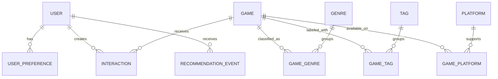

# Data model

## Design principles

- PostgreSQL is the source of truth for application state.
- Relational fields represent stable game metadata and taxonomy.
- Many-to-many relationships use explicit association tables.
- Timestamps are timezone-aware and stored in UTC.
- Natural identifiers such as slugs have uniqueness constraints.
- Foreign keys and common lookup paths receive indexes.
- JSON is reserved for genuinely flexible recommendation-event context.

The Stage 1 Alembic migration chain is the executable source of truth for this
model. Revision `0002_stage_1_integrity_hardening` upgrades databases that
already applied the initial schema without resetting their data.

## Entity relationship overview

## Core entities

### Game

| Field | Notes |
| --- | --- |
| `id` | Internal primary key |
| `external_id` | Nullable identifier from a documented source |
| `title` | Required display title |
| `slug` | Unique stable URL identifier |
| `description` | Plain-text game summary |
| `release_date` | Nullable date |
| `developer`, `publisher` | Nullable normalized display values for MVP |
| `average_rating` | Nullable aggregate rating |
| `rating_count` | Non-negative count, default zero |
| `popularity_score` | Documented numeric baseline signal |
| `cover_image_url` | Nullable; no binary cover image in the database |
| `created_at`, `updated_at` | UTC audit timestamps |

### Genre, Tag, and Platform

Each taxonomy table has an internal ID, unique name, and unique slug.
Association tables use composite uniqueness so a game cannot receive the same
taxonomy value twice.

### User

The MVP user has an internal ID and unique anonymous key. A nullable external
authentication identifier may be introduced with authentication later.
Recommendation logic depends only on the internal ID and supplied context.

### UserPreference

Stores weighted selections such as genre, tag, platform, or example game. The
combination of user, type, and value should be unique unless versioned
preference history becomes a later requirement.

### Interaction

Associates a user and game with one of:

- `viewed`
- `liked`
- `disliked`
- `played`
- `wishlisted`
- `rated`

Only `rated` carries a numeric value, which is required to be from 0 through
10; every other interaction type requires a null value. Each event has a UTC
timestamp. Stage 1 preserves interactions as repeatable events. State-like
upsert policy is deferred until feedback write endpoints are designed in
Stage 4.

### RecommendationEvent

Records the user, model name and version, generation time, bounded request
context, and optionally a compact top-K result summary. It supports audit and
evaluation without treating logged recommendations as user feedback.
PostgreSQL checks require request context to be a JSON object and a non-null
result summary to be a JSON array.

## Index and constraint plan

- Unique indexes on game, genre, tag, and platform slugs.
- Indexes on game title and common catalog filters.
- Composite indexes on interaction user/time and game/type.
- Index on recommendation event user/generation time.
- Check constraints enforce ratings from 0 through 10, non-negative counts and
  popularity, preference weights from -1 through 1, lowercase slug shape,
  interaction-value semantics, and recommendation JSON shapes.
- User-owned preferences, interactions, and recommendation events cascade when
  a user is deleted. Game-taxonomy associations cascade with either side.
  Games referenced by interactions use `RESTRICT`.

## Migration policy

Alembic migrations begin in Stage 1. Every schema change must include a
migration, model update, tests, and documentation update. Development seed
data is loaded by a separate deterministic command and must not be embedded in
schema migrations.
