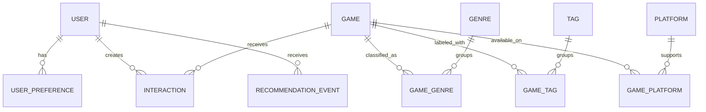

# Data model

## Design principles

- PostgreSQL is the source of truth for application state.
- Relational fields represent stable game metadata and taxonomy.
- Many-to-many relationships use explicit association tables.
- Timestamps are timezone-aware and stored in UTC.
- Natural identifiers such as slugs have uniqueness constraints.
- Foreign keys and common lookup paths receive indexes.
- JSON is reserved for genuinely flexible recommendation-event context.

The Stage 1 Alembic migration chain is the executable source of truth for this
model. Revision `0002_stage_1_integrity_hardening` upgrades databases that
already applied the initial schema without resetting their data.

The
[Stage 4 feedback-and-persistence plan](stage-4-feedback-persistence-plan.md)
defines a forward-looking activation and migration policy for the existing
future-facing user tables. Its token-digest, consent, temporal state, and event
identity fields are not implemented until the corresponding Alembic revisions
exist and pass their acceptance gates.

## Entity relationship overview

## Core entities

### Game

| Field | Notes |
| --- | --- |
| `id` | Internal primary key |
| `external_id` | Nullable identifier from a documented source |
| `title` | Required display title |
| `slug` | Unique stable URL identifier |
| `description` | Plain-text game summary |
| `release_date` | Nullable date |
| `developer`, `publisher` | Nullable normalized display values for MVP |
| `average_rating` | Nullable aggregate rating |
| `rating_count` | Non-negative count, default zero |
| `popularity_score` | Documented numeric baseline signal |
| `cover_image_url` | Nullable; no binary cover image in the database |
| `created_at`, `updated_at` | UTC audit timestamps |

### Genre, Tag, and Platform

Each taxonomy table has an internal ID, unique name, and unique slug.
Association tables use composite uniqueness so a game cannot receive the same
taxonomy value twice.

### User

The current placeholder user has an internal ID and unique anonymous key. No
public contract creates or resolves it. Stage 4 plans to replace plaintext-key
semantics with a unique keyed token digest plus consent version/time and fixed
expiry/revocation state. Legacy rows will remain unconsented, explicitly
revoked, and inaccessible rather than being silently authenticated or assigned
fabricated consent. Account identity and cross-device recovery remain deferred.

Recommendation logic receives bounded context only; neither internal user ID
nor token material enters model artifacts.

### UserPreference

Stores weighted selections such as genre, tag, platform, or example game. The
combination of user, type, and value should be unique unless versioned
preference history becomes a later requirement.

Stage 4 plans an atomic replace-all API that validates every current catalog
reference before mutation, stores canonical stable slugs, and keeps weights
server-owned. Identical replacement and clearing are idempotent. Stale stored
references are reported rather than silently ignored or deleted.

### Interaction

Associates a user and game with one of:

- `viewed`
- `liked`
- `disliked`
- `played`
- `wishlisted`
- `rated`

Only `rated` carries a numeric value, which is required to be from 0 through
10; every other interaction type requires a null value. Each current row has a
UTC occurrence timestamp. Stage 1 preserves interactions as repeatable rows
and exposes no write API.

Stage 4 plans to add `superseded_at` and treat a null value there as active
state. Partial unique indexes will allow at most one active liked/disliked
reaction and one active played, wishlisted, or rated state per user/game.
Changing state will supersede the prior row and insert the new state in one
transaction; clearing will supersede it; identical writes will be no-ops.
Older rows remain temporal history rather than being deleted. `viewed` remains
repeatable and receives no implicit Stage 4 page-view write.

### RecommendationEvent

Records the user, model name and version, generation time, bounded request
context, and optionally a compact top-K result summary. It supports audit and
evaluation without treating logged recommendations as user feedback.
PostgreSQL checks require request context to be a JSON object and a non-null
result summary to be a JSON array.

Stage 4 plans to add unique generation ID, event-schema, catalog
data-fingerprint, and personalization-policy identity. New events will be
application-bounded to typed context metadata, a fingerprint of the complete
effective feedback state, and at most 20 compact result objects. They will not
store credentials, headers, internal user ID inside JSON, descriptions, or
explanation prose. An event is bounded audit/correlation data for a committed
server generation, not a standalone replay snapshot or proof of browser
receipt, view, click, conversion, or positive feedback.

## Index and constraint plan

- Unique indexes on game, genre, tag, and platform slugs.
- Indexes on game title and common catalog filters.
- Composite indexes on interaction user/time and game/type.
- Index on recommendation event user/generation time.
- Stage 4 plans unique active temporal-interaction indexes, an anonymous
  token-digest lookup, an expiry cleanup index, and model/policy/time event
  indexes.
- Check constraints enforce ratings from 0 through 10, non-negative counts and
  popularity, preference weights from -1 through 1, lowercase slug shape,
  interaction-value semantics, and recommendation JSON shapes.
- User-owned preferences, interactions, and recommendation events cascade when
  a user is deleted. Game-taxonomy associations cascade with either side.
  Games referenced by interactions use `RESTRICT`.

## Migration policy

Alembic migrations begin in Stage 1. Every schema change must include a
migration, model update, tests, and documentation update. Development seed
data is loaded by a separate deterministic command and must not be embedded in
schema migrations.

Stage 4 migrations must be exercised from empty, `0001`, `0002`, and populated
legacy fixtures. They may revoke inaccessible placeholder credentials but may
not fabricate consent or assume user tables are empty. Retention and user
deletion remain explicit application operations rather than migration or seed
side effects.
