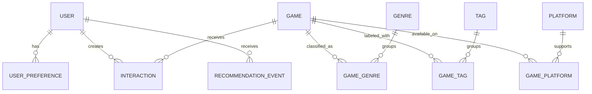

# Data model

## Design principles

- PostgreSQL is the source of truth for application state.
- Relational fields represent stable game metadata and taxonomy.
- Many-to-many relationships use explicit association tables.
- Timestamps are timezone-aware and stored in UTC.
- Natural identifiers such as slugs have uniqueness constraints.
- Foreign keys and common lookup paths receive indexes.
- JSON is reserved for genuinely flexible recommendation-event context.

The Alembic migration chain is the executable source of truth for this model.
Stage 4 extends the Stage 1 chain through expected head
`0005_stage_4_event_contract` without embedding seed or retention behavior in
migrations.

The
[Stage 4 feedback-and-persistence plan](stage-4-feedback-persistence-plan.md)
defines the activation and migration policy for the existing future-facing
user tables. Revisions `0003_stage_4_anonymous_identity`,
`0004_stage_4_interaction_state`, and `0005_stage_4_event_contract` now
implement the token-digest, consent, temporal-state, and event-identity schema.
The 49-test disposable-PostgreSQL suite passes, including populated legacy
upgrade and concurrent feedback serialization.

The current cross-stack evidence also passes 184 fast API, 52 ML, and 76 web
tests; the PostgreSQL suite completes in 4.53 seconds. The final 38-case
exact-host Docker browser matrix passes in 1.3 minutes without retry: 28
Chromium, 5 Firefox, and 5 WebKit. The rebuilt no-cache
`gamelens-ai-api:stage4-test` image with digest prefix `11b2f940731e`
removes unused Debian `perl-base` after all install steps, resolving its earlier
two critical and two high findings. Runtime imports, `pip check`, and all 49
PostgreSQL tests remain green. Its comprehensive Docker Scout scan reports 0
critical, 0 high, 3 medium, 27 low, and 2 unspecified findings across 193
packages; its only-fixed scan reports no actionable fixed advisory. Final
release diff/privacy review is clean, and the Stage 4 completion record is in
the detailed plan.

## Entity relationship overview

## Core entities

### Game

| Field | Notes |
| --- | --- |
| `id` | Internal primary key |
| `external_id` | Nullable identifier from a documented source |
| `title` | Required display title |
| `slug` | Unique stable URL identifier |
| `description` | Plain-text game summary |
| `release_date` | Nullable date |
| `developer`, `publisher` | Nullable normalized display values for MVP |
| `average_rating` | Nullable aggregate rating |
| `rating_count` | Non-negative count, default zero |
| `popularity_score` | Documented numeric baseline signal |
| `cover_image_url` | Nullable; no binary cover image in the database |
| `created_at`, `updated_at` | UTC audit timestamps |

### Genre, Tag, and Platform

Each taxonomy table has an internal ID, unique name, and unique slug.
Association tables use composite uniqueness so a game cannot receive the same
taxonomy value twice.

### User

An anonymous user has an internal ID, a unique 64-character keyed token digest,
consent version/time, fixed expiry, and nullable revocation time. The raw
32-byte URL-safe credential is never stored. `POST /api/v1/anonymous-sessions`
is the only public identity-creation contract; protected lookups resolve the
cookie through its domain-separated HMAC-SHA-256 digest. Legacy plaintext-key
rows are migrated to deterministic replacement digests and marked revoked,
without fabricated consent. Account identity and cross-device recovery remain
deferred. For migrated legacy rows the exact non-authenticating value is
`md5('legacy-revoked-v1:' || anonymous_key) || lpad(to_hex(id), 32, '0')`;
the ID suffix guarantees uniqueness while null consent plus `revoked_at` makes
the row inaccessible.

Recommendation logic receives bounded context only; neither internal user ID
nor token material enters model artifacts.

### UserPreference

Stores weighted selections such as genre, tag, platform, or example game. The
combination of user, type, and value should be unique unless versioned
preference history becomes a later requirement.

Stage 4 implements an atomic replace-all API that validates every current
catalog reference before mutation, stores canonical stable slugs, and keeps
weights server-owned. Identical replacement and clearing are idempotent. Stale
stored references are reported rather than silently ignored or deleted.

### Interaction

Associates a user and game with one of:

- `viewed`
- `liked`
- `disliked`
- `played`
- `wishlisted`
- `rated`

Only `rated` carries a numeric value, which is required to be from 0 through
10; every other interaction type requires a null value. Each current row has a
UTC occurrence timestamp. Stage 1 preserves interactions as repeatable rows
and exposes no write API.

Revision `0004_stage_4_interaction_state` adds `superseded_at`; a null value
denotes active state. PostgreSQL partial unique indexes permit at most one
active liked/disliked reaction and one active played, wishlisted, or rated
state per user/game. Changing state supersedes the prior row and inserts the
new state in one transaction; clearing supersedes it; identical writes are
no-ops. Older rows remain temporal history rather than being deleted. `viewed`
remains repeatable and receives no implicit Stage 4 page-view write.

### RecommendationEvent

Records the user, model name and version, generation time, bounded request
context, and optionally a compact top-K result summary. It supports audit and
evaluation without treating logged recommendations as user feedback.
PostgreSQL checks require request context to be a JSON object and a non-null
result summary to be a JSON array.

Revision `0005_stage_4_event_contract` adds a unique generation ID,
event-schema version, catalog data fingerprint, and personalization-policy
identity. New `stage-4-v1` events are application-bounded to typed context
metadata, a fingerprint of the complete effective feedback state, and at most
20 compact result objects. They do not store credentials, headers, internal
user ID inside JSON, descriptions, or explanation prose. An event is bounded
audit/correlation data for a committed server generation, not a standalone
replay snapshot or proof of browser receipt, view, click, conversion, or
positive feedback. Pre-Stage-4 events are marked `legacy-v1` and retain
nullable data/policy identity.

## Planned Stage 5 Derived-Data Boundary

The
[Stage 5 engineering plan](stage-5-collaborative-hybrid-ranking-plan.md) is
ready, but no Stage 5 table, migration, interaction snapshot, or collaborative
artifact exists yet. PostgreSQL interactions and saved preferences remain the
source state; generated model input and artifacts are derived data with their
own provenance and lifecycle.

The proposed snapshot captures one PostgreSQL-generated cutoff in a
repeatable-read, read-only transaction. Contributor eligibility requires an
approved, current aggregate-training purpose plus unrevoked and unexpired
state. A temporal interaction is active at the cutoff only when its occurrence
is not later than the cutoff and its supersession is null or later than the
cutoff. Canonical stable game slugs align the snapshot with the exact catalog
fingerprint.

The proposed positive edge is binary and collapses a saved positive `game`
preference, an active like, or an active rating of at least 7 when no dislike
overrides it. Views, played-only, wishlist-only, unknown state, low ratings,
dislikes, and recommendation events do not become positive matrix entries.
Superseded occurrences reconstruct as-of state; they are not repeated votes.
Recommendation events remain generation audit records, never interaction
labels.

The guarded extractor may use an internal user ID transiently to group rows,
but it serializes no user ID, token digest, stable pseudonym, credential, or
per-user mapping. A canonical fingerprint and aggregate counts describe the
input. The planned collaborative artifact stores only item-level neighbors,
similarity/support arrays, configuration, catalog and interaction identity,
checksums, cutoff, revision, and validity metadata.

Phase 0 proposes a separate contribution-consent boundary, a monotonic source
revision for snapshot/promotion consistency, and protected build/contributor
lineage in PostgreSQL. Those schema details must be fixed in an Alembic
revision before implementation. Their purpose is to make a cleared or changed
included label, withdrawal, revocation, expiry, or user deletion invalidate
the affected artifact immediately. A new positive after the artifact cutoff
may wait for the next build without changing the immutable snapshot.
Identity-bearing lineage must stay in PostgreSQL with user cascades; it must
not appear in the artifact, API, event JSON, logs, audit reports, or browser.

Generated snapshots and bundles remain ignored. Obsolete bundles are not
serveable and require an explicit preview/confirmation retirement workflow.
If consent and derived-data invalidation cannot be proven end to end, live-data
collaborative activation stays disabled and only the project-authored fixture
may exercise the functional pipeline.

## Index and constraint plan

- Unique indexes on game, genre, tag, and platform slugs.
- Indexes on game title and common catalog filters.
- Composite indexes on interaction user/time and game/type.
- Index on recommendation event user/generation time.
- Stage 4 adds unique active temporal-interaction indexes, an anonymous
  token-digest lookup, expiry/revocation cleanup indexes, and
  model/policy/time event indexes.
- Check constraints enforce ratings from 0 through 10, non-negative counts and
  popularity, preference weights from -1 through 1, lowercase slug shape,
  interaction-value semantics, and recommendation JSON shapes.
- User-owned preferences, interactions, and recommendation events cascade when
  a user is deleted. Game-taxonomy associations cascade with either side.
  Games referenced by interactions use `RESTRICT`.

## Migration policy

Alembic migrations begin in Stage 1. Every schema change must include a
migration, model update, tests, and documentation update. Development seed
data is loaded by a separate deterministic command and must not be embedded in
schema migrations.

Stage 4 migrations are implemented for empty, `0001`, `0002`, and populated
legacy starting points. The disposable PostgreSQL suite passes 49 tests,
including populated `0002` upgrade, constraints, event/delete cascade,
concurrent feedback writes, and bounded retention. The migrations revoke
inaccessible placeholder credentials but do not fabricate consent or assume
user tables are empty. Populated downgrade/re-upgrade evidence passes in the
verified Stage 4 gate. Retention and user deletion remain explicit application
operations rather than migration or seed side effects.
