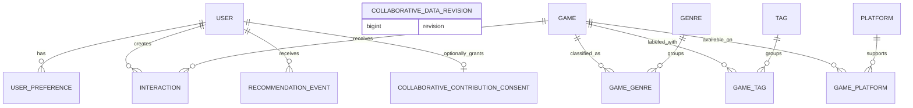

# Data model

## Design principles

- PostgreSQL is the source of truth for application state.
- Relational fields represent stable game metadata and taxonomy.
- Many-to-many relationships use explicit association tables.
- Timestamps are timezone-aware and stored in UTC.
- Natural identifiers such as slugs have uniqueness constraints.
- Foreign keys and common lookup paths receive indexes.
- JSON is reserved for genuinely flexible recommendation-event context.

The Alembic migration chain is the executable source of truth for this model.
Stage 5 Phase 1 extends the Stage 1–4 chain through expected head
`0006_stage_5_collab_contract` without embedding seed, fixture, audit, build,
or retention behavior in migrations.

The
[Stage 4 feedback-and-persistence plan](stage-4-feedback-persistence-plan.md)
defines the activation and migration policy for the existing future-facing
user tables. Revisions `0003_stage_4_anonymous_identity` through
`0005_stage_4_event_contract` implement token-digest, consent, temporal-state,
and event-identity schema. Revision `0006_stage_5_collab_contract` adds
separate contribution consent and monotonic collaborative source revision.
The 54-test disposable-PostgreSQL suite passes, including populated legacy
upgrade, no fabricated contribution consent, and concurrent snapshot tests.

The current cross-stack evidence passes 193 fast API, 105 ML, 54 PostgreSQL, and
76 web tests. The 38-case exact-host Docker browser matrix passes in 59.6
seconds without retry: 28
Chromium, 5 Firefox, and 5 WebKit. The rebuilt no-cache
`gamelens-ai-api:stage4-test` image with digest prefix `11b2f940731e`
removes unused Debian `perl-base` after all install steps, resolving its earlier
two critical and two high findings. Runtime imports, `pip check`, and all 49
PostgreSQL tests remain green. Its comprehensive Docker Scout scan reports 0
critical, 0 high, 3 medium, 27 low, and 2 unspecified findings across 193
packages; its only-fixed scan reports no actionable fixed advisory. Final
release diff/privacy review is clean, and the Stage 4 completion record is in
the detailed plan.

## Entity relationship overview

## Core entities

### Game

| Field | Notes |
| --- | --- |
| `id` | Internal primary key |
| `external_id` | Nullable identifier from a documented source |
| `title` | Required display title |
| `slug` | Unique stable URL identifier |
| `description` | Plain-text game summary |
| `release_date` | Nullable date |
| `developer`, `publisher` | Nullable normalized display values for MVP |
| `average_rating` | Nullable aggregate rating |
| `rating_count` | Non-negative count, default zero |
| `popularity_score` | Documented numeric baseline signal |
| `cover_image_url` | Nullable; no binary cover image in the database |
| `created_at`, `updated_at` | UTC audit timestamps |

### Genre, Tag, and Platform

Each taxonomy table has an internal ID, unique name, and unique slug.
Association tables use composite uniqueness so a game cannot receive the same
taxonomy value twice.

### User

An anonymous user has an internal ID, a unique 64-character keyed token digest,
consent version/time, fixed expiry, and nullable revocation time. The raw
32-byte URL-safe credential is never stored. `POST /api/v1/anonymous-sessions`
is the only public identity-creation contract; protected lookups resolve the
cookie through its domain-separated HMAC-SHA-256 digest. Legacy plaintext-key
rows are migrated to deterministic replacement digests and marked revoked,
without fabricated consent. Account identity and cross-device recovery remain
deferred. For migrated legacy rows the exact non-authenticating value is
`md5('legacy-revoked-v1:' || anonymous_key) || lpad(to_hex(id), 32, '0')`;
the ID suffix guarantees uniqueness while null consent plus `revoked_at` makes
the row inaccessible.

Recommendation logic receives bounded context only; neither internal user ID
nor token material enters model artifacts.

### UserPreference

Stores weighted selections such as genre, tag, platform, or example game. The
combination of user, type, and value should be unique unless versioned
preference history becomes a later requirement.

Stage 4 implements an atomic replace-all API that validates every current
catalog reference before mutation, stores canonical stable slugs, and keeps
weights server-owned. Identical replacement and clearing are idempotent. Stale
stored references are reported rather than silently ignored or deleted.

### Interaction

Associates a user and game with one of:

- `viewed`
- `liked`
- `disliked`
- `played`
- `wishlisted`
- `rated`

Only `rated` carries a numeric value, which is required to be from 0 through
10; every other interaction type requires a null value. Each current row has a
UTC occurrence timestamp. Stage 1 preserves interactions as repeatable rows
and exposes no write API.

Revision `0004_stage_4_interaction_state` adds `superseded_at`; a null value
denotes active state. PostgreSQL partial unique indexes permit at most one
active liked/disliked reaction and one active played, wishlisted, or rated
state per user/game. Changing state supersedes the prior row and inserts the
new state in one transaction; clearing supersedes it; identical writes are
no-ops. Older rows remain temporal history rather than being deleted. `viewed`
remains repeatable and receives no implicit Stage 4 page-view write.

### RecommendationEvent

Records the user, model name and version, generation time, bounded request
context, and optionally a compact top-K result summary. It supports audit and
evaluation without treating logged recommendations as user feedback.
PostgreSQL checks require request context to be a JSON object and a non-null
result summary to be a JSON array.

Revision `0005_stage_4_event_contract` adds a unique generation ID,
event-schema version, catalog data fingerprint, and personalization-policy
identity. New `stage-4-v1` events are application-bounded to typed context
metadata, a fingerprint of the complete effective feedback state, and at most
20 compact result objects. They do not store credentials, headers, internal
user ID inside JSON, descriptions, or explanation prose. An event is bounded
audit/correlation data for a committed server generation, not a standalone
replay snapshot or proof of browser receipt, view, click, conversion, or
positive feedback. Pre-Stage-4 events are marked `legacy-v1` and retain
nullable data/policy identity.

## Implemented Stage 5 Phase 0–1 Data Boundary

### CollaborativeContributionConsent

`collaborative_contribution_consents` is separate from the base personalization
consent on `users`. The user ID is both primary key and cascading foreign key;
`consent_version` is required and non-blank, `granted_at` is required, and an
optional `withdrawn_at` cannot precede the grant. The populated migration
creates no consent rows for existing users. No public API currently grants this
consent, so the product flow and live activation remain blocked.

### CollaborativeDataRevision

`collaborative_data_revision` has exactly one logical row
(`singleton_id=1`), a non-negative bigint revision, and an update timestamp.
PostgreSQL statement triggers increment it for mutations to users,
contribution consent, preferences, interactions, games, taxonomies, and
catalog association tables. Recommendation events do not increment it. The
trigger atomically recreates the singleton after a test-only truncate and a
subsequent source mutation. Until then, the live extractor rejects the missing
revision with a typed fail-closed error.

User deletion cascades contribution consent and existing user-owned source
state; the source-table mutation advances the revision. Withdrawal, revocation,
expiry changes, feedback changes, and catalog changes also advance it. Phase
0–1 writes no row-level snapshot or model bundle, so there is no derived file
to retain or delete yet. A future promotion must recheck the captured revision
and add protected build/contributor lineage before serving is possible.

### Canonical interaction audit input

The live repository requires PostgreSQL and one verified `REPEATABLE READ,
READ ONLY` transaction. Its initialization query calls
`pg_current_snapshot()` to pin MVCC visibility before returning and captures
one `clock_timestamp()` cutoff in that same query. Eligibility requires current
base consent, unexpired/unrevoked state, and the
configured contribution version granted and not withdrawn at the cutoff. An
interaction is active as of the cutoff only when `occurred_at <= cutoff` and
`superseded_at IS NULL OR superseded_at > cutoff`.

Preference and interaction reads join one reusable eligible-user subquery and
stream in 1,000-row batches; they never expand one bind parameter per user.
Label policy `gamelens-collaborative-labels/1.0.0` produces binary positive
edges. Dislike dominates; otherwise an active like, rating of at least 7, or
saved positive game preference is positive. Views, played-only,
wishlist-only, low ratings, non-game preferences, superseded/post-cutoff rows,
and recommendation events are absent.

Only the sorted multiset of sorted stable-slug profiles plus the exact current
catalog fingerprint crosses into ML. Internal user IDs remain transient. Audit
schema 1 emits aggregate distributions, support diagnostics, catalog and
interaction fingerprints, cutoff, revision, typed reasons, and privacy flags;
it writes no per-user row or cohort mapping.

The committed project-authored fixture has 12 synthetic profiles, 36 expected
positive edges, 6 supported items, exclusions, and cold-start cases. It loads
only with `ENVIRONMENT=test` plus explicit fixture permission and cannot prove
quality or live-data authority. Generated snapshots and bundles remain ignored.
No collaborative artifact or serving path exists in Phase 0–1.

Phase 2 adds a fixture-only offline artifact under the ignored `ml/artifacts/`
boundary. It contains item-level aggregate support and neighborhoods, not a
user matrix or contributor lineage. No database table or serving reference was
added: protected live build/contributor lineage, invalidation, and retirement
remain required before a live-derived bundle can activate.

## Index and constraint plan

- Stage 5 adds a one-row-per-user contribution-consent primary/foreign key,
  grant/withdrawal ordering, and singleton/non-negative revision checks.
- PostgreSQL statement triggers own monotonic revision changes for every
  eligible source/catalog table while excluding recommendation events.
- Unique indexes on game, genre, tag, and platform slugs.
- Indexes on game title and common catalog filters.
- Composite indexes on interaction user/time and game/type.
- Index on recommendation event user/generation time.
- Stage 4 adds unique active temporal-interaction indexes, an anonymous
  token-digest lookup, expiry/revocation cleanup indexes, and
  model/policy/time event indexes.
- Check constraints enforce ratings from 0 through 10, non-negative counts and
  popularity, preference weights from -1 through 1, lowercase slug shape,
  interaction-value semantics, and recommendation JSON shapes.
- User-owned contribution consent, preferences, interactions, and
  recommendation events cascade when a user is deleted. Game-taxonomy
  associations cascade with either side. Games referenced by interactions use
  `RESTRICT`.

## Migration policy

Alembic migrations begin in Stage 1. Every schema change must include a
migration, model update, tests, and documentation update. Development seed
data is loaded by a separate deterministic command and must not be embedded in
schema migrations.

Stage 4 migrations remain verified for empty, `0001`, `0002`, and populated
legacy starting points. `0006_stage_5_collab_contract` upgrades and downgrades
without assuming empty user tables, grants no contribution consent, seeds only
the non-authority revision singleton, and installs/removes bounded source
triggers. The 54-test PostgreSQL suite covers populated downgrade/re-upgrade,
constraints, cascades, source versus event revision changes, label/temporal
exclusions, repeatable-read concurrency, and typed revision races. Retention,
user deletion, audits, fixture loading, and model builds remain application or
operator actions rather than migration side effects.
