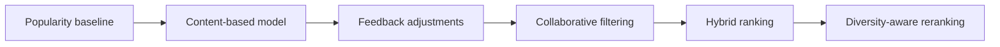

# Recommendation design

## Objective

GameLens AI will produce ranked game recommendations using project-owned
signals. The first usable model must work from a small local dataset and an
anonymous user's onboarding choices, without paid services or an external
recommendation API.

## Algorithm progression

Each component must be independently testable and evaluable. A later model is
not automatically considered better; it must be compared with accepted
baselines.

## Recommendation interface

The API recommendation service will depend on a replaceable model contract
with the following conceptual capabilities:

- Fit or build an artifact in an offline process.
- Recommend from user context and candidate games for a requested top-K.
- Expose a stable model name and version.
- Report artifact readiness and feature metadata.

Stage 1 may define the interface, but it must not expose an untrained content
model as active.

## Popularity baseline

The first baseline will combine rating quality, rating volume, and a
documented popularity signal. A Bayesian or IMDb-style weighted rating should
prevent games with one perfect rating from dominating.

The exact formula, inputs, defaults, and normalization will be versioned and
covered by deterministic tests.

## Content-based MVP

Stage 3 will build a text representation from:

- Title
- Genres and tags
- Developer and publisher
- Description

TF-IDF provides the first feature space, with cosine similarity for ranking.
A user vector combines selected games and weighted taxonomy preferences.
Preferred platforms contribute a separate interpretable signal rather than
being hidden in free text.

Candidate filtering occurs before ranking:

- Exclude explicitly disliked games.
- Exclude unavailable or invalid records.
- Optionally reduce scores for played games.
- Apply deterministic tie-breaking.

## Response evidence

Each recommendation will eventually return:

- Final score and rank.
- Model name and version.
- Component scores.
- Matching genres and tags.
- Similar selected games where applicable.
- Preferred-platform contribution.
- Popularity contribution.

User-facing explanations are deterministically generated from these signals.
An optional LLM may rewrite an explanation later, but it cannot determine the
ranked list and the application must work without it.

## Training and artifacts

- Preprocessing and training run outside request handling.
- Random operations use recorded seeds.
- Artifacts include model version, feature configuration, data fingerprint,
  creation time, and compatible code/schema metadata.
- Production code fails clearly when an expected artifact is unavailable.
- Small deterministic fixtures may be committed only when required by tests.

## Evaluation

After an interaction pipeline exists, offline evaluation will compare models
with the popularity baseline using applicable metrics:

- Precision@K
- Recall@K
- Hit Rate@K
- NDCG@K
- Catalog coverage
- Intra-list diversity
- Novelty when its popularity definition is defensible

A temporal user split is preferred when timestamps are available. Otherwise,
the holdout strategy and limitations must be documented. Results are generated
as machine-readable data and a Markdown report; no result is invented.

## Deferred work

Collaborative filtering, hybrid weighting, semantic embeddings, exploration,
LLM explanations, and diversity reranking are intentionally outside the first
MVP model.
