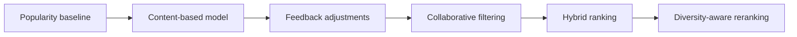

# Recommendation design

## Objective

GameLens AI produces ranked game recommendations using project-owned
signals. The first usable model must work from a small local dataset and an
anonymous user's onboarding choices, without paid services or an external
recommendation API.

## Algorithm progression

Each component must be independently testable and evaluable. A later model is
not automatically considered better; it must be compared with accepted
baselines.

## Recommendation interface

The API recommendation service depends on a replaceable model contract
with the following conceptual capabilities:

- Fit or build an artifact in an offline process.
- Recommend from user context and candidate games for a requested top-K.
- Expose a stable model name and version.
- Report artifact readiness and feature metadata.

Stage 1 introduced this interface as a replaceable service protocol. Stage 3
implements it with an immutable content service and exposes state through
`GET /api/v1/models/status`: no path configured is `not_configured`; a failed
load, catalog mismatch, or catalog canonicalization failure is `unavailable`;
the last condition uses reason `catalog_invalid`. Only a validated artifact
matching the current catalog is `ready`. `POST /api/v1/recommendations` never
falls back to invented results.

The detailed
[Stage 3 plan and completion record](stage-3-content-recommendation-mvp-plan.md)
defines the activation sequence and verified implementation decisions. `ready`
is reported only after a configured artifact passes integrity, compatibility,
and current-catalog validation.

## Popularity baseline

The first baseline combines rating quality and volume with the documented
synthetic popularity signal. A Bayesian weighted rating uses a 50-vote prior
and the vote-weighted catalog rating mean. A missing rating uses that mean.
Weighted rating and synthetic popularity are independently min-max normalized;
a constant range maps to 0.5. The final baseline is 70% rating and 30%
popularity. It contributes a documented prior to content results but is never a
silent fallback when the configured artifact is unavailable.

## Content-based MVP

Stage 3 builds a text representation from:

- Title
- Genres and tags
- Developer and publisher
- Description

Field-aware documents repeat title twice; each genre and tag token three times;
and developer, publisher, and description once. Word TF-IDF uses Unicode accent
stripping, one- and two-grams, `min_df=1`, `max_df=1.0`, sublinear term
frequency, L2 normalization, and float64 sparse values. Cosine-equivalent dot
products over normalized vectors provide content similarity.

A request-scoped anonymous user vector combines the normalized selected-game
centroid with positive genre/tag preference tokens using model-owned versioned
weights. Either source receives 100% when alone; together they receive 65% and
35% before the result is normalized again.
Clients do not supply arbitrary floating-point weights. Preferred platforms
contribute a separate interpretable signal rather than being hidden in free
text.

The Stage 3 request accepts bounded distinct selected game IDs, preferred
genre/tag/platform slugs, and top-K. At least one selected game, genre, or tag
is required; platform-only input is not enough to form the content query.
Unknown or duplicate references are controlled validation errors. No request
creates a user or writes preferences, interactions, or recommendation events.

Candidate filtering occurs before ranking:

- Resolve database IDs to stable artifact slugs.
- Exclude selected example games from their own results.
- Reject stale or structurally invalid artifacts before ranking.
- Do not promote a zero-content-support candidate through platform or
  popularity alone.
- Apply deterministic score and stable-slug tie-breaking.

Feedback-derived disliked-game exclusion and played-game adjustment begin in
Stage 4 after persistence and write contracts exist. The current data model has
no general game-availability field, so Stage 3 does not imply an unavailable
state that the catalog cannot represent.

Model version `1.0.0` combines content at 80%, preferred-platform overlap at
10%, and popularity at 10%. Genre/tag preferences contribute to the content
query rather than appearing as a second final-score component, avoiding hidden
double counting. A raw ranking score is not a probability or calibrated match
percentage. Components are quantized to a 1,000,000 fixed scale with
round-half-up before ordering;
serialized weighted contributions sum exactly to the serialized final score,
and ties resolve by final score, content score, popularity score, then stable
slug.

## Planned feedback and persistence layer

The detailed
[Stage 4 engineering plan](stage-4-feedback-persistence-plan.md) defines a
separate explicit-consent personalized path. Planning does not activate it:
the current `POST /api/v1/recommendations` remains request-scoped, ignores any
future identity cookie, and performs no write.

The planned personalized endpoint will use canonical saved preferences as its
base context and apply a separately versioned feedback policy before top-K
truncation:

- Explicit dislikes are hard exclusions.
- Active likes and, when no reaction exists, ratings of at least 7 form a
  deduplicated recent-five positive feedback profile.
- Positive source games are excluded from their own results.
- When a profile exists, 90% of the Stage 3 base score combines with 10%
  artifact-vector affinity; without a profile the exact base score/order is
  retained.
- Played candidates remain eligible and receive a fixed 0.5 adjustment.
- Wishlist is persisted but has no ranking effect in policy version 1.
- Every intermediate and final value uses the existing fixed scale and
  round-half-up policy with a complete stable tie-break.

The intended feedback policy identity is distinct from content model
`gamelens-content-tfidf` version `1.0.0`. Base content, platform, and popularity
components remain visible; personalized responses add affinity and played
adjustment details that reconstruct the final score. If implementation changes
artifact-owned feature or base-ranking semantics, it must instead bump the
model/code compatibility, rotate the artifact path, rebuild, and record that
decision. It may not silently redefine the existing artifact.

User IDs, token digests, consent, preferences, interactions, and events never
enter the immutable artifact. A successful personalized generation will commit
one bounded event carrying exact model, data-fingerprint, policy, bounded
context metadata, a fingerprint of the complete effective state, and compact
result identity. The event is audit/correlation data for server generation,
not a standalone replay snapshot, impression, click, conversion, or positive
label.

## Response evidence

Each Stage 3 recommendation returns:

- Final score and rank.
- Model name and version.
- Raw component scores, weights, and weighted contributions.
- Matching genres and tags.
- Similar selected games where applicable.
- Preferred-platform contribution.
- Popularity contribution.

User-facing explanations are deterministically generated from these signals.
They may not introduce a reason that is absent from structured evidence.
An optional LLM may rewrite an explanation later, but it cannot determine the
ranked list and the application must work without it.

## Training and artifacts

The implemented Stage 3 artifact lifecycle:

- Runs preprocessing and training outside request handling.
- Uses no random operation in the version-1 builder.
- Stores artifact-schema and model versions, feature and ranking configuration,
  stable slug mapping, data fingerprint, creation time, member sizes and
  checksums, and compatible code/library/schema metadata.
- Uses transparent non-executable JSON and numeric sparse-array formats for the
  first artifact rather than pickle-compatible model deserialization.
- Rejects non-canonical CSR indices, negative feature weights, IDF weights
  below one, and feature rows that are not L2-normalized before activating the
  ranker.
- Writes to a temporary sibling and promotes only after complete validation.
- Treats the configured operator-controlled artifact root as the provenance
  trust boundary; self-recorded checksums detect corruption but do not
  authenticate who produced a replaced bundle.
- Distinguishes no configuration from configured-but-missing, corrupt,
  incompatible, catalog-stale, or `catalog_invalid` states.
- Keeps catalog behavior available when recommendation capability is not and
  fails recommendation requests clearly rather than fabricate results.
- Keeps generated bundles ignored; tests build their deterministic fixture in a
  temporary directory.

Generated development artifacts remain ignored by Git. Activating a new
artifact requires an explicit offline build and API restart; request
handling and ordinary startup will never fit or mutate a model. Operators
adopting stricter loader rules rotate `MODEL_ARTIFACT_PATH`, rebuild and
validate the bundle, and restart the API instead of changing an artifact in
place.

Stage 4 feedback computation will consume the loaded artifact read-only. User
state remains bounded per-request input and is never serialized back into the
bundle or retained on the application-lifecycle ranker.

## Evaluation

After an interaction pipeline exists, offline evaluation will compare models
with the popularity baseline using applicable metrics:

- Precision@K
- Recall@K
- Hit Rate@K
- NDCG@K
- Catalog coverage
- Intra-list diversity
- Novelty when its popularity definition is defensible

A temporal user split is preferred when timestamps are available. Otherwise,
the holdout strategy and limitations must be documented. Results are generated
as machine-readable data and a Markdown report; no result is invented.

## Deferred work

Persistent preferences, feedback adjustment, disliked-game filtering, and
recommendation-event logging are specified by the Stage 4 engineering plan but
are not implemented yet. Collaborative filtering and content/collaborative
hybrid ranking are Stage 5 work. Formal ranking evaluation is Stage 6 work.
Semantic embeddings, exploration, LLM explanations, and diversity reranking
remain outside the first MVP model.
