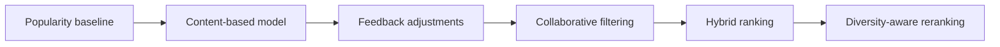

# Recommendation design

## Objective

GameLens AI will produce ranked game recommendations using project-owned
signals. The first usable model must work from a small local dataset and an
anonymous user's onboarding choices, without paid services or an external
recommendation API.

## Algorithm progression

Each component must be independently testable and evaluable. A later model is
not automatically considered better; it must be compared with accepted
baselines.

## Recommendation interface

The API recommendation service will depend on a replaceable model contract
with the following conceptual capabilities:

- Fit or build an artifact in an offline process.
- Recommend from user context and candidate games for a requested top-K.
- Expose a stable model name and version.
- Report artifact readiness and feature metadata.

Stage 1 implements this interface as a replaceable service protocol and exposes
its state through `GET /api/v1/models/status`. The current implementation
reports `not_configured`, has no active model, advertises no recommendation or
explanation capability, and raises a clear error if recommendation execution is
attempted internally. No recommendation endpoint is exposed until a real model
is implemented and validated.

The detailed
[Stage 3 engineering plan](stage-3-content-recommendation-mvp-plan.md) defines
the activation sequence. Planning completion does not change runtime status:
`ready` will be reported only after a configured artifact passes integrity,
compatibility, and current-catalog validation.

## Popularity baseline

Stage 3 will implement the first baseline by combining rating quality, rating
volume, and the documented synthetic popularity signal. A Bayesian or
IMDb-style weighted rating will prevent games with one perfect rating from
dominating.

The exact prior, formula, inputs, missing-value policy, normalization,
combination weights, defaults, and tie behavior will be versioned and covered
by deterministic tests. The baseline remains independently rankable and may
contribute a documented prior to the content result. It is not a silent
fallback when the configured content artifact is unavailable.

## Content-based MVP

Stage 3 will build a text representation from:

- Title
- Genres and tags
- Developer and publisher
- Description

TF-IDF provides the first feature space, with cosine similarity for ranking.
A request-scoped anonymous user vector combines selected-game vectors with
positive genre/tag preference tokens using model-owned versioned weights.
Clients do not supply arbitrary floating-point weights. Preferred platforms
contribute a separate interpretable signal rather than being hidden in free
text.

The Stage 3 request will accept bounded distinct selected game IDs, preferred
genre/tag/platform slugs, and top-K. At least one selected game, genre, or tag
is required; platform-only input is not enough to form the content query.
Unknown or duplicate references are controlled validation errors. No request
creates a user or writes preferences, interactions, or recommendation events.

Candidate filtering occurs before ranking:

- Resolve database IDs to stable artifact slugs.
- Exclude selected example games from their own results.
- Reject stale or structurally invalid artifacts before ranking.
- Do not promote a zero-content-support candidate through platform or
  popularity alone.
- Apply deterministic score and stable-slug tie-breaking.

Feedback-derived disliked-game exclusion and played-game adjustment begin in
Stage 4 after persistence and write contracts exist. The current data model has
no general game-availability field, so Stage 3 will not imply an unavailable
state that the catalog cannot represent.

Stage 3 will combine bounded, independently observable content, explicit
taxonomy where justified, platform, and popularity components. The exact
normalization and non-negative weights are part of the model version. A raw
ranking score is not a probability or calibrated match percentage.
Components are quantized into versioned fixed-scale units before ordering;
serialized weighted contributions sum exactly to the serialized final score,
and stable slugs resolve quantized ties.

## Response evidence

Each Stage 3 recommendation will return:

- Final score and rank.
- Model name and version.
- Raw component scores, weights, and weighted contributions.
- Matching genres and tags.
- Similar selected games where applicable.
- Preferred-platform contribution.
- Popularity contribution.

User-facing explanations are deterministically generated from these signals.
They may not introduce a reason that is absent from structured evidence.
An optional LLM may rewrite an explanation later, but it cannot determine the
ranked list and the application must work without it.

## Training and artifacts

The planned Stage 3 artifact lifecycle will:

- Run preprocessing and training outside request handling.
- Record seeds for any random operation.
- Store artifact-schema and model versions, feature and ranking configuration,
  stable slug mapping, data fingerprint, creation time, member sizes and
  checksums, and compatible code/library/schema metadata.
- Use transparent non-executable JSON and numeric sparse-array formats for the
  first artifact rather than pickle-compatible model deserialization.
- Write to a temporary location and promote only after complete validation.
- Treat the configured operator-controlled artifact root as the provenance
  trust boundary; self-recorded checksums detect corruption but do not
  authenticate who produced a replaced bundle.
- Distinguish no configuration from configured-but-missing, corrupt,
  incompatible, or catalog-stale artifacts.
- Keep catalog behavior available when recommendation capability is not and
  fail recommendation requests clearly rather than fabricate results.
- Commit a small deterministic fixture only when tests require it.

Generated development artifacts will remain ignored by Git. Activating a new
artifact will require an explicit offline build and API restart; request
handling and ordinary startup will never fit or mutate a model.

## Evaluation

After an interaction pipeline exists, offline evaluation will compare models
with the popularity baseline using applicable metrics:

- Precision@K
- Recall@K
- Hit Rate@K
- NDCG@K
- Catalog coverage
- Intra-list diversity
- Novelty when its popularity definition is defensible

A temporal user split is preferred when timestamps are available. Otherwise,
the holdout strategy and limitations must be documented. Results are generated
as machine-readable data and a Markdown report; no result is invented.

## Deferred work

Persistent preferences, feedback adjustment, disliked-game filtering, and
recommendation-event logging are Stage 4 work. Collaborative filtering and
content/collaborative hybrid ranking are Stage 5 work. Formal ranking
evaluation is Stage 6 work. Semantic embeddings, exploration, LLM
explanations, and diversity reranking remain outside the first MVP model.
